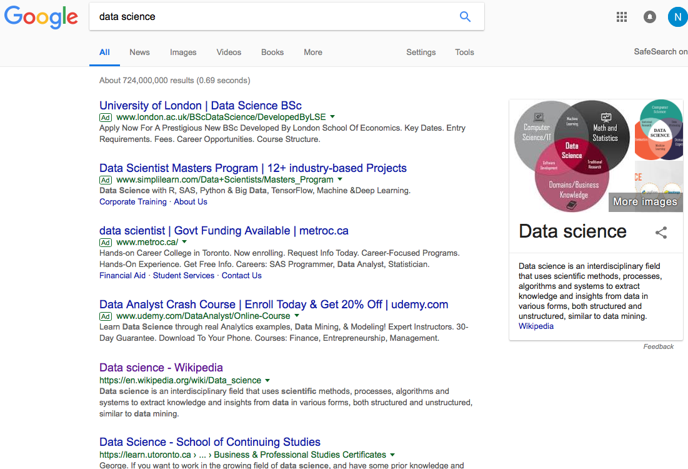
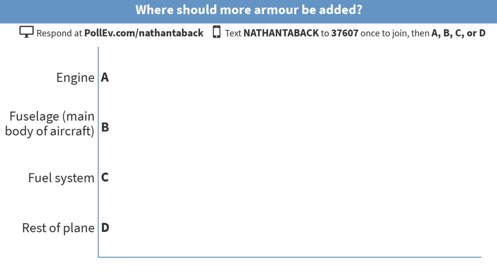

```{r setup, include=FALSE}
# R options
options(
  htmltools.dir.version = FALSE, # for blogdown
  show.signif.stars = FALSE,     # for regression output
  warm = 1
  )
# Set dpi and height for images
library(knitr)
opts_chunk$set(fig.height = 2.65, dpi = 300) 
# ggplot2 color palette with gray
color_palette <- list(gray = "#999999", 
                      salmon = "#E69F00", 
                      lightblue = "#56B4E9", 
                      green = "#009E73", 
                      yellow = "#F0E442", 
                      darkblue = "#0072B2", 
                      red = "#D55E00", 
                      purple = "#CC79A7")
# For nonsese...
library(emo)
htmltools::tagList(rmarkdown::html_dependency_font_awesome())
library(tidyverse)
```


# Welcome to STA130  `r emo::ji("happy")`

## This class

- What is data science?

--

- What is statistical reasoning?

--

- Introduction to the course (syllabus, website, etc.)

--

- Introduction to R and RStudio.

--

- Distributions of quantitative and categorical variables.

--

- Plotting distributions using `ggplot2`.

---

## What is data science?

- <i class="fa fa-database fa-2x"></i> + <i class="fa fa-flask fa-2x"></i> = data science?

--

- <i class="fa fa-database fa-2x"></i> + <i class="fa fa-code fa-2x"></i> = data science?

--

- <i class="fa fa-database fa-2x"></i> + <i class="fa fa-user fa-2x"></i> + <i class="fa fa-code fa-2x"></i> = data science?

--

- <i class="fa fa-database fa-2x"></i> + <i class="fa fa-users fa-2x"></i> + <i class="fa fa-code fa-2x"></i> = data science?

--

<br>

Data science is an exciting discipline that allows you to turn raw data into understanding, insight, and knowledge. We're going to learn to do this in a `tidy` way -- more on that later!


---

## Applications of Data Science

- Internet search: Google, Yahoo, Bing, etc. use data science algorithms to rank web pages for a search query.



---

## Applications of Data Science

Recommender Systems: Netflix, Hinge, Amazon, Google, etc. use data science algorithms in recommender systems to suggest products (or dating partners) in accordance with user's interests. 

.pull-right[]

.pull-left[]

---

## Applications of Data Science

- Logistics, health care, image and speech recognition, ...

---
## What is statistical reasoning?

.pull-right[]

.pull-left[
- Abraham Wald born in 1902 in Austria.
- Emigrated to the U.S. and eventually became a professor at Columbia.
- During World War II he spent much of his time in the Statistical Research Group (SRG).  A classified program that assembled the best American statisticians to the war effort.
]

---

## What is statistical reasoning?

.center[]


- The SRG was in an apartment building in NYC a few blocks from Columbia U.
--

- The SRG was a very influential group and the military frequently listened to their advice.

--

- Wald at the time was still an “enemy alien” , he was not technically allowed to see the reports he was producing.


---

## Missing bullet holes problem

.pull-left[

**Question:**  You don’t want planes to get shot down by enemy fighters, so you amour them.  But armour makes planes heavier, and are less maneuverable and use more fuel.  Armouring planes too much is a problem; armouring the planes too little is a problem. 

]

.pull-right[

]

---

## Missing bullet holes problem

.center[]

<br>

Planes were covered in bullet holes, but the holes weren’t uniformly distributed across the aircraft.


---

## Missing bullet holes problem

Data from American planes that came back from engagements over Europe.

.large[**Question: What parts of the plane has the greatest need for armour?**]

Section of Plane | Bullet holes per square foot
-----------------|-----------------------------
Engine           | 1.11
Fuselage (main body of aircraft)         | 1.73
Fuel system      | 1.55
Rest of plane    | 1.8

---

## Missing bullet holes problem

The officers saw an opportunity for efficiency.

Get the same protection with less armour if you concentrate on places with the greatest need.

They asked Wald how much more armour belonged on those parts of the plane.  

Section of Plane | Bullet holes per square foot
-----------------|-----------------------------
Engine           | 1.11
Fuselage (main body of aircraft)         | 1.73
Fuel system      | 1.55
Rest of plane    | 1.8

---

.small[Section of Plane | Bullet holes per square foot
-----------------|-----------------------------
Engine           | 1.11
Fuselage (main body of aircraft)         | 1.73
Fuel system      | 1.55
Rest of plane    | 1.8]


---
## Who am I?

<i class="fa fa-envelope"></i> &nbsp; [nathan.taback@utoronto.ca](mailto:nathan.taback@utoronto.ca) <br>
<i class="fa fa-home"></i> &nbsp; [http://sta130.utstat.toronto.edu](http://sta130.utstat.toronto.edu) <br>
<i class="fa fa-university"></i> &nbsp; [Sidney Smith, SS6027C](https://goo.gl/maps/AUTtBjVXuZM2) <br>
<i class="fa fa-calendar"></i> &nbsp; Monday 12:30 - 14:00 (after class I'll go to my office).

---


# What is this course?

Everything you want to know about the course, and everything you will need for the course will be posted at

[http://sta130.utstat.toronto.edu](http://sta130.utstat.toronto.edu)

--

- Will we be doing computing? Yes.

--

- Is this an intro CS course? No, but many themes are shared.

--

- Is this an intro stat course? Yes, but it's not your high school statistics course.

--

- What computing language will we learn? R.

--

- Why not language X? We can discuss that over `r emo::ji("coffee")`.


---

## Create an RStudio.cloud account


Go to this [link](https://rstudio.cloud/spaces/3186/join?access_code=b0A03f8ziEjE1fmGJ3CTYyhab1n%2FR5yB1EYBLczh) to join the STA130_Fall2018 workspace on rstudio.cloud.

---

## World happiness

**What influences your happiness?**

We'll look at the data from the [World Happiness Report 2017](http://worldhappiness.report)

[Video](https://youtu.be/Se2gfFKp1Iw)

Data from the Gallup World Poll is in the file happinessdata_2017.csv.

---

### Read the data into R

```{r, message=FALSE}
# Read in the data
happinessdata_2017 <- read_csv("happinessdata_2017.csv")
```

---
### View the data

There are two ways to view a data set in RStudio.

1. Click on the Environment tab in the upper right hand corner (Environment, History, Connections pane).  Then click on the data set


2. Type `glimpse(happinessdata_2017)` in an R code chunk.  

```{r}
# type the command here
```

---
### Questions:

1. What does each row and column represent?
2. How many rows and columns are in `happinessdata_2017`?

---

## How is happiness measured and ranked?

> The rankings are based on answers to the main life evaluation question asked in the poll. This is called the Cantril ladder: it asks respondents to think of a ladder, with the best possible life for them being a 10, and the worst possible life being a 0. They are then asked to rate their own current lives on that 0 to 10 scale. (Ref: <http://worldhappiness.report/faq/>)


---

### What is the distribution of the Cantril ladder?

- We need to figure out the variable name of Cantril ladder.

- `life_ladder` — average response for a country to the question:   
*“Please imagine a ladder, with steps numbered from 0 at the bottom to 10 at the top.  The top of the ladder represents the best possible life for you and the bottom of the ladder represents the worst possible life for you.  On which step of the ladder would you say you personally feel you stand at this time?”*

- The `life_ladder` variable is an example of a **numerical (quantitative) variable**.  A quantitative variable takes numerical values that are ordered and differences are meaningful.

- The **distribution** of a variable tells us what values it takes and how often it takes these values.

---

## Examining the distribution of `life_ladder`: histogram

This code 

```{r plot-label, eval=FALSE}
library(tidyverse)
ggplot(data = happinessdata_2017) + 
  aes(x = life_ladder) + 
  geom_histogram()
```


produces this plot (histogram)

.center[
```{r plot-label-out, ref.label="plot-label", echo=FALSE, fig.height=1.5}
```
]

---

## Graphical exploration of data

We’ll use the `ggplot2` package in `R` to construct our graphs. 

“gg” = Grammar of Graphics (Leland Wilkinson), a structure to combine graphical elements together to make a meaningful display of data

To use ggplot2 functions, need to first load the package `ggplot2`, which is also part of the `tidyverse` package.

```{r, eval=F}
library(tidyverse)
```

---

## `ggplot2`

.pull-left[In `ggplot2`, the structure of the code to produce most plots is

```{r, eval=F}
ggplot(data=[datset], 
       aes(x=[var1], 
           y=[var2])) +
  geom_xxx( ) +
  other options
```
]

.pull-right[
- **aesthetic**: mapping between a variable and where it will be represented on the graph (e.g., x axis, colour-coding, etc.) 

- **geometry**: what are you plotting (e.g., points , lines, histogram, etc.)
    - Every plot must have at least one geometry and there is no upper limit 
    - You add a geometry to a plot using `+`
]


---

## histogram using `ggplot2`

```{r eval=FALSE}
library(tidyverse)
ggplot(data = happinessdata_2017) + 
  aes(x = life_ladder) + 
  geom_histogram()
```

- Just need one aesthetic, `x`.

---

## Constructing a histogram

- Count the number of numerical values that lie within ranges, called bins.
- Bins are defined by their lower bounds (inclusive); the upper bound is the lower bound of the next bin. 
- Histogram displays the distribution (count (default) or `density`) of the numerical values in the bins.
- Horizontal axis is numerical, hence no gaps.

---
# Number of Bins of a histogram

```{r, eval=FALSE}
library(tidyverse)
ggplot(data = happinessdata_2017) + 
  aes(x = life_ladder) + 
  # colour is outline of bin
  geom_histogram(bins = 2, colour = "black", fill = "grey")

ggplot(data = happinessdata_2017) + 
  aes(x = life_ladder) + 
  geom_histogram(bins = 10, colour = "black", fill = "grey") 
```


```{r, echo=FALSE, message=FALSE, fig.height=2}
library(tidyverse)
library(gridExtra)

p1 <- ggplot(data = happinessdata_2017) + 
  aes(x = life_ladder) + 
  geom_histogram(bins = 3, colour = "black", fill = "grey")

p2 <- ggplot(data = happinessdata_2017) + 
  aes(x = life_ladder) + 
  geom_histogram(bins = 10, 
                 colour = "black", 
                 fill = "grey") 
grid.arrange(p1,p2, nrow = 1)
```


---

## Properties of distributions

.pull-left[
- **Shape** of the distribution: 
    - could be *symmetric*, *left-skewed*, *right-skewed* (skew is to the direction of the longer tail) 
    - number of **modes (peaks)**: unimodal, bimodal, multimodal, uniform
    - unusual observations
]

.pull-right[
```{r, message=FALSE, echo=FALSE, warning=FALSE, fig.height=2}
library(tidyverse)
set.seed(10)

ggplot(data = happinessdata_2017, aes(x = social_support, y = ..density..)) +
  geom_density(colour = "red") +
  geom_histogram(bins = 20, colour = "black", fill = "grey")

x1 <- rnorm(1000)

ggplot(data = data_frame(x1), aes(x = x1, y = ..density..)) +
  geom_density(colour = "red") +
  geom_histogram(bins = 40, colour = "black", fill = "grey")

x2 <- rexp(n = 1000, rate = 10)

ggplot(data = data_frame(x2), aes(x = x2, y = ..density..)) +
  geom_density(colour = "red") +
  geom_histogram(bins = 40, colour = "black", fill = "grey")

x3 <- rnorm(1000, mean = 4)

ggplot(data = data_frame(x1, x3), aes(x = x1)) +
  geom_histogram(aes(x = x1,  y = ..density..), bins = 40, colour = "black", fill = "grey") +
  geom_histogram(aes(x = x3, y = ..density..), bins = 40, colour = "black", fill = "grey") + geom_density(aes(x = x1), colour = "red") + geom_density(aes(x = x3), colour = "green")
```
]

---

## Basic plots for a categorical variable: bar plot

- Displays the distribution of a categorical variable, the frequency of its different values   
- Heights (or lengths) of bars are proportional to the percent of individuals
- Bars have arbitrary (but equal) widths and spacings

---

```{r}
ggplot(data = happinessdata_2017, aes(x = continent)) + 
  geom_bar()
```

---

An alternative, particularly useful for long labels

```{r}
ggplot(data = happinessdata_2017, aes(x = continent)) + 
  geom_bar() +
  coord_flip()
```

---

# Looking at the relationship between two variables

---

## What is the relationship between happiness and wealth?

```{r, fig.height=1.5}
library(tidyverse)
ggplot(data = happinessdata_2017) +
  aes(x = logGDP, y = life_ladder) +
  geom_point()
```

A **scatterplot** of `life_ladder` versus `logGDP` consists of points representing a countries with values of both `life_ladder` and `logGDP`.  What happens if one of the values is missing for a country?

---

## What is the relationship between between happiness, wealth, and continent?

```{r, fig.height=2}
library(tidyverse)
ggplot(data = happinessdata_2017, ) +
  aes(x = logGDP, y = life_ladder, colour = continent) +
  geom_point() 
```

Colour the points by continent.

---

```{r, fig.height=2}
library(tidyverse)
ggplot(data = happinessdata_2017, ) +
  aes(x = logGDP, y = life_ladder) +
  geom_point() +
  facet_wrap(~continent)
```

`facet_wrap()` produces a sequence of rectangular plots.


