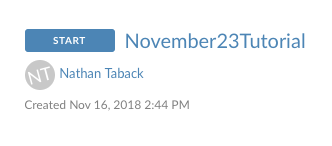

```{r setup, include=FALSE}
knitr::opts_chunk$set(echo = TRUE)
```

# September  Tutorial

## Answer the questions using RStudio Cloud (recommended)

1. Go to R Studio Cloud [workspace for this assignment](https://rstudio.cloud/spaces/3186/join?access_code=b0A03f8ziEjE1fmGJ3CTYyhab1n%2FR5yB1EYBLczh).


2. Click on projects.


3. Click on November30Tutorial (screen shot for November 23 tutorial, but it's the same idea).



4. Look for the file "practice_probs_nov30.Rmd" under the Files tab then click on it to open.

5. Change the subtitle to "Week11PracticeProblemsSolutions" and change the author to your name and student number.


Remember that [R code chunks](http://rmarkdown.rstudio.com/authoring_rcodechunks.html) can be inserted directly into the notebook by choosing Insert R from the Insert menu (see Using [R Markdown for Class Assignments](https://ntaback.github.io/UofT_STA130/Rmarkdownforclassreports.html)). In addition this R Markdown [cheatsheet](http://www.rstudio.com/wp-content/uploads/2016/03/rmarkdown-cheatsheet-2.0.pdf), and [reference](http://www.rstudio.com/wp-content/uploads/2015/03/rmarkdown-reference.pdf) are great resources as you get started with R Markdown. 


## Answer the questions using RStudio installed on your own computer

Download R Markdown questions file directly into RStudio by typing the following code into the RStudio console window.   

```{r,eval=FALSE}
file_url <- "https://raw.githubusercontent.com/ntaback/UofT_STA130/master/Fall2018/week11/Tutorial/practice_probs_nov30.Rmd"
download.file(url = file_url , destfile = "practice_probs_nov23.Rmd")
```

You will need to install several libraries such as `tidyverse`, and `mosaic` to complete the questions.

Look for the file "practice_probs_nov23.Rmd" under the Files tab then click on it to open.