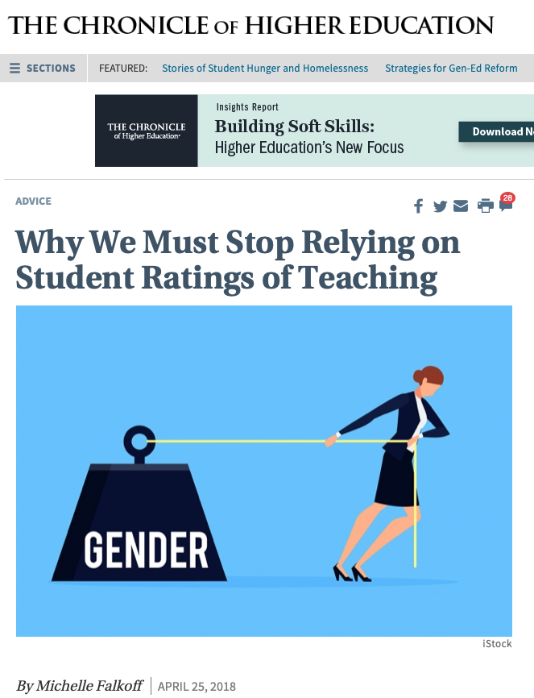

```{r setup, include=FALSE}
# R options
options(
  htmltools.dir.version = FALSE, # for blogdown
  show.signif.stars = FALSE,     # for regression output
  warm = 1
  )
# Set dpi and height for images
library(knitr)
opts_chunk$set(fig.height = 2.65, dpi =300, warning=FALSE, message=FALSE) 
# ggplot2 color palette with gray
color_palette <- list(gray = "#999999", 
                      salmon = "#E69F00", 
                      lightblue = "#56B4E9", 
                      green = "#009E73", 
                      yellow = "#F0E442", 
                      darkblue = "#0072B2", 
                      red = "#D55E00", 
                      purple = "#CC79A7")
# For nonsese...
library(emo)
library(tidyverse)
library(gridExtra)
library(mdsr)
htmltools::tagList(rmarkdown::html_dependency_font_awesome())

knitr::opts_chunk$set(echo = TRUE, warning = FALSE, message = FALSE)
```


## Today's Class

- Inference for regression parameters
- Regression when the independent variable is a categorical variable
- Is the regression line the same for two groups?
- An example of a variable affecting a relationship in a non-regression setting
-  Confounding


---

## Inference for regression parameters

What affects course evaluations?

... other than the quality of the course ...

* Data from course evaluations for a random sample of courses at the University of Texas at Austin.
* Each observation corresponds to a course.
* `score` is the average student evaluation for the course. 
* `bty_avg` is the average beauty rating of the professor, based on ratings of physical appear from 6 students in the course.

```{r, eval=FALSE, echo=FALSE}
download.file("http://www.openintro.org/stat/data/evals.RData", destfile = "evals.RData")
```


```{r, echo=FALSE}
load("evals.RData")
```

---

```{r}
glimpse(evals)
```

---

##Relationship between `score` and `bty_avg`?


```{r}
ggplot(evals, aes(x=bty_avg, y=score)) + 
  geom_point() + theme_bw()
```

---

Use some transparency so we can see where there are overlapping points

```{r}
ggplot(evals, aes(x=bty_avg, y=score)) + 
  geom_point(alpha=0.3) + theme_bw()
```

---

Is there a relationship between `score` and `bty_avg`?  

```{r, fig.height=3}
ggplot(evals, aes(x = bty_avg, y = score)) + 
  geom_point(alpha = 0.3) + theme_bw() + 
  geom_smooth(method = "lm", fill = NA)
```

---

What would the slope be if there was no relationship?

<br>
<br>
<br>

```{r, fig.height=4, echo=FALSE}
ggplot(evals, aes(x=bty_avg, y=score)) + geom_point(alpha=0.3)  + theme_bw() + 
  geom_smooth(method = "lm", fill=NA)
```

---
## Confidence interval for the slope
.pull-left[
- The grey shaded area around the fitted regression line is a 95% confidence interval for the slope. 

```{r, fig.height=3}
ggplot(evals, 
       aes(x = bty_avg,
           y = score)) + 
  geom_point(alpha = 0.3)  + 
  theme_bw() + 
  geom_smooth(method = "lm")
```
]

.pull-right[
- The width of the confidence interval varies with the independent variable `bty_avg`.
- The confidence interval is wider at the extremes; the regression is estimated most precisely near the mean of the independent variable.
- The confidence interval for the slope shown is calculated based on a probability model, but can also be calculated using the bootstrap.
]


---

```{r, echo=FALSE}
ggplot(evals, aes(x=bty_avg, y=score)) + geom_point(alpha=0.3)  + theme_bw() + 
  geom_smooth(method = "lm")
```

*Does the confidence interval indicate that 0 is a possible value for $\beta_1$ (the parameter for the slope)?*

---

## Inference for regression part 2: <br>Hypothesis test for the slope
.small[
- Output from the summary command for the estimated regression coefficients gives results for an hypothesis test with hypotheses:  
$$H_0: \beta_1 = 0 \mbox{ versus } H_a: \beta_1 \ne 0$$


```{r}
summary(lm(score ~ bty_avg, data = evals))$coefficients
```


- The estimate of the slope is 0.06664.

- The `lm()` function, by default, calculates the P-value for regression coeffcients based on a probability model that assumes all observations are *independent* and that the error terms have a *symmetric, bell-shaped distribution*.

- The P-value is $5.08 \times 10^{-5}  = 0.0000508$

- *Does the hypothesis test for the slope indicate that the slope is different from 0?*
]
---

## What other factors might affect course evaluations?




---

# Regression when the independent variable is a categorical variable

---

## Relationship between `score` and `gender`?

.small[
```{r, fig.height=2, echo=TRUE}
ggplot(evals, aes(x = gender, y = score)) + 
  geom_point(alpha = 1/5) + 
  theme_bw() 

evals %>% 
  group_by(gender) %>% 
  summarise(n = n(), mean = mean(score))
```
]

---
 
## Regression with `gender` as the independent variable

```{r, echo=TRUE}
lm(score ~ gender, data=evals)$coefficients
```

$$ \widehat{score} = 4.09 + 0.14 \, male $$

Interpretation: On average, course evaluation scores for male professors are $0.14$ higher than for female professors.


---
## Regression with `gender` as the independent variable

$$ \widehat{score} = 4.09 + 0.14 \, male $$

- In regression, `R` encodes categorical independent variables as **indicator variables** (also called **dummy variables**).
- `R` picks a baseline value of the categorical variable.  Here the baseline level is `female`.
- The indicator variable `male` is 1 for observations for which `gender` is male and 0 otherwise.
- For females, $$\widehat{score} = 4.09$$
- For males, $$\widehat{score} = 4.09 + 0.14 = 4.23$$

---

*Could the difference between the mean score for males and females just be due to chance?*

The regression model is
$$score_i = \beta_0 + \beta_1 \, male_i + \epsilon_i, i = 1, \ldots, 463$$
where,

$$male_i = 
\begin{cases} 1 & \mbox{if } i^{th} gender\mbox{ is }  male\\ 
              0 & \mbox{if } i^{th} gender\mbox{ is } female. 
\end{cases}$$

 
We can answer the question with an hypothesis test with hypotheses
$$H_0: \beta_1 = 0 \mbox{ versus } H_a: \beta_1 \ne 0$$

---

```{r}
summary(lm(score ~ gender, data=evals))$coefficients
```

What conclusion do we make?
---

# Is the regression line the same for two groups?

---

##Is the relationship between `score` and `bty_avg` the same for male and female professors?

```{r, fig.height=3}
ggplot(evals, aes(x = bty_avg, y = score, colour = gender)) + 
  geom_point(alpha = 0.5) + theme_bw()
```

---

**Model 1:**
$$score_i = \beta_0 + \beta_1 \, male_i + \beta_2 \, bty\_avg_i + \epsilon_i, i=1,\ldots, 463$$

Model 1 for male professors:
$$score_i = \beta_0 + \beta_1  + \beta_2 \, bty\_avg_i + \epsilon_i, i=1,\ldots, 463$$

Model 1 for female professors:
$$score_i = \beta_0  + \beta_2 \, bty\_avg_i + \epsilon_i, i=1,\ldots, 463$$


---

##Fitted parallel lines

```{r}
parallel_lines <- lm(score ~ gender + bty_avg, data=evals)
parallel_lines$coefficients
```

---

##Plotting the parallel lines

The `augment` function (in the library `broom`) creates a data frame with predicted values (`.fitted`), residuals, etc. for linear model output.

```{r, warning=FALSE}
library(broom)
augment(parallel_lines)
```

---

Join up the fitted values to plot the parallel lines model

```{r, fig.height=3}
ggplot(evals, aes(x = bty_avg, y = score, colour = gender)) + 
  geom_point(alpha = 0.5) + theme_bw() +
  geom_line(data = augment(parallel_lines), 
            aes(y = .fitted, colour = gender))
```

---

##Lines for each gender that aren't parallel

.midi[
Add an independent variable to the model that is the product of `male` and `bty_avg`.  This is called an **interaction term**.

**Model 2:**
$$score_i = \beta_0 + \beta_1 \, male + \beta_2 \, bty\_avg_i + \beta_3 \, (male \times bty\_avg)_i + \epsilon_i$$

Model 2 for male professors:
$$score_i  =  \beta_0 + \beta_1 + \beta_2 \, bty\_avg_i + \beta_3 \,  bty\_avg_i + \epsilon_i$$
$$score_i  =  (\beta_0 + \beta_1) + (\beta_2 + \beta_3) \, bty\_avg_i + \epsilon_i$$

Model 2 for female professors:
$$score_i  =  \beta_0  + \beta_2 \, bty\_avg_i  + \epsilon_i$$
]

---

##Plot of non-parallel lines

```{r, fig.height=3}
ggplot(evals, aes(x = bty_avg, y = score, colour = gender)) + 
  geom_point(alpha = 0.5) +  theme_bw() +
  geom_smooth(method = lm, fill = NA)
```

---

##Fitted lines for male and female professors

Including the term `bty_avg*gender` on the right-side of the model specification in `lm` includes the interaction term plus both of the variables in the model.

```{r}
summary(lm(score ~ bty_avg*gender, data=evals))$coefficients
```

*What are the fitted lines for male and for female professors?*

---

##Could the difference in the slopes for male and female professors just be due to chance?

Model:
$$score =  \beta_0 + \beta_1 \, male + \beta_2 \, bty\_avg + \beta_3 \, (male \times bty\_avg) + \epsilon$$

*What would be appropriate hypotheses to test?*

<br>
<br>
<br>

*What do you conclude?*

---

## Example: eBay auctions of *Mario Kart*

* Items can be sold on [ebay.com](http://www.ebay.com/) through an auction.
* The person who bids the highest price before the auction ends purchases the item.
* The `marioKart` dataset in the `openintro` package includes eBay sales of the game *Mario Kart* for Nintendo Wii in October 2009.
* Do longer auctions (`duration`, in days) result in higher prices (`totalPr`)?

---

```{r, warning=FALSE, message=FALSE}
library(openintro)
glimpse(marioKart)
```

---

```{r}
ggplot(marioKart, aes(x=duration, y=totalPr)) + 
  geom_point() + theme_bw()
```

---

## What should we do with the two outlying values of `totalPr`?

* Remove outliers only if there is a good reason.
* In these two auctions, and only these two auctions, the game was sold with other items.

```{r}
# create a data set without the outliers
marioKart2 <- marioKart %>% filter(totalPr < 100)
```

---

```{r}
ggplot(marioKart2, aes(x=duration, y=totalPr)) + 
  geom_point() + theme_bw()
```

---

```{r, fig.height=3}
ggplot(marioKart2, aes(x = duration, y = totalPr)) + 
  geom_point() + theme_bw() + geom_smooth(method = "lm") 
```

There appears to be a negative relationship between `totalPr` and `duration`.  
That is, the longer an item is on auction, the lower the price. 

*Does this make sense?*  

---

Maybe there actually isn't a relationship.

We can investigate if the data are consistent with a slope of 0.

```{r}
summary(lm(totalPr ~ duration, data=marioKart2))$coefficients
```

We have strong evidence that the slope is not 0.  

There must be something else affecting the relationship ...


---

Consider the role of `cond`.  
`cond` is a categorical variable for the game's condition, either `new` or `used`.

```{r, fig.height=3}
ggplot(marioKart2, aes(x=duration, y=totalPr, color=cond)) + 
  geom_point() + theme_bw()
```

New games, which are more desirable, were mostly sold in one-day auctions.

---

```{r, fig.height=3}
ggplot(marioKart2, aes(x=duration, y=totalPr, color=cond)) + 
  geom_point() + geom_smooth(method="lm", fill=NA) + theme_bw()
```

- Considering `cond` changes the nature of the relationship between `totalPr` and `duration`.  
- This is an example of **Simpson's Paradox** in which the nature of a relationship that we see in all observations changes when we look at sub-groups.

---

## The fitted lines

.small[
```{r}
summary(lm(totalPr ~ duration, data = marioKart2))$coefficients

marioKart2_used <- marioKart2 %>% filter(cond == "used")
summary(lm(totalPr ~ duration, data = marioKart2_used))$coefficients

marioKart2_new <- marioKart2 %>% filter(cond == "new")
summary(lm(totalPr ~ duration, data = marioKart2_new))$coefficients

summary(lm(totalPr ~ duration*cond, data = marioKart2))$coefficients
```
]
---

# An example of a variable affecting a relationship between two variables in a non-regression setting: <br> Data in two-way tables

---

## A Classic Example: Treatment for kidney stones

Source of data: *British Medical Journal (Clinical Research Edition)* March 29, 1986

```{r, echo=FALSE}
kidney_stones <- data_frame(size=c(rep("small",357), rep("large",343)), treatment=c(rep("A",87), rep("B",270), rep("A",263), rep("B",80)),
                            outcome=c(rep("success",81), rep("failure",6), rep("success", 234), rep("failure", 36),
                                      rep("success",192), rep("failure",71), rep("success", 55), rep("failure", 25)))
```

- Observations are patients being treated for kidney stones.  
- `treatment` is one of 2 treatments (`A` or `B`)
- `outcome` is `success` or `failure` of the treatment


```{r}
kidney_stones %>% count(treatment, outcome)
```

*What would make it easier to decide which treatment is better?*

---

## Describing Two-Way Tables

 
.small[
- The (2x2) *contingency table* below shows counts of patients being treated for kidney stones.  

```{r, echo=TRUE}
tab <- table(kidney_stones$outcome, 
             kidney_stones$treatment, deparse.level = 2)
addmargins(tab)
```

- Proportion of observations in each cell of contingency table.
```{r, echo=TRUE}
prop.table(tab)
```

- **Joint, marginal, and conditional distributions**.
```{r, echo=TRUE}
addmargins(prop.table(tab))
```
]

---

## Some vocabulary

*Recall:* The distribution of a variable is the pattern of values in the data for that variable, showing the frequency or relative frequency (proportions) of the occurrence of the values relative to each other.

We can also look at the **joint distribution** of two variables.  If both variables are categorical, we can see their joint distribution in a **contingency table** showing the counts of observations in each way the data can be cross-classifed.

A **marginal distribution** is the distribution of only one of the variables in a contingency table.

A **conditional distribution** is the distribution of a variable within a fixed value of a second variable.


What percentage of successes were Treatment A?

<br>
<br>

What percentage of Treatment A surgeries resulted in a success?

---

## Some additional information

- A is an invasive open surgery treatment 
- B is a new less invasive treatment
- Doctors get to choose the treatment, depending on the patient
- What might influence how a doctor chooses a treatment for their patient?

---

## Kidney stones come in various sizes

```{r}
kidney_stones %>% 
  count(size, treatment, outcome) %>%
  group_by(size, treatment) %>%
  mutate(per_success = n / sum(n)) #%>%
  #filter(outcome=="success")
```

---

.small[
Column percentages (conditional distribution of success given treatment):

```{r, echo=TRUE}
prop.table(table(kidney_stones$outcome, kidney_stones$treatment), margin = 2)

large <- kidney_stones %>% filter(size == "large")
prop.table(table(large$outcome, large$treatment),margin = 2)

small <- kidney_stones %>% filter(size == "small")
prop.table(table( small$outcome, small$treatment), margin = 2)
```
]


*Which treatment is better?*

---

This example is another case of **Simpson's paradox**.  

### Moral of the story:

Be careful drawing conclusions from data!  
It's important to understand how the data were collected and what other factors might have an affect.

---
.small[
Visualizing the kidney stone data: treatment and outcome

```{r, fig.height=1.8}
ggplot(kidney_stones, aes(x=treatment, fill=outcome)) + 
  geom_bar(position = "fill") + 
  labs(y = "Proportion") + theme_bw()
```


Visualizing the kidney stone data: treatment and outcome by size

```{r, fig.height=1.8}
ggplot(kidney_stones, aes(x=treatment, fill=outcome)) + 
  geom_bar(position = "fill") + labs(y = "Proportion") + 
  facet_grid(. ~ size) + 
  theme_bw()
```
]
---

# Confounding
---

## What is a **confounding variable**?

* When examining the relationship between two variables in observational studies, it is important to consider the possible effects of other variables.

--

* A third variable is a **confounding variable** if it affects the nature of the relationship between two other variables, so that it is impossible to know if one variable causes another, or if the observed relationship is due to the third variable.

--

* The possible presence of confounding variables means we must be cautious when interpreting relationships.

---

## Examples of confounding?

* A 2012 [study](http://www.pnas.org/content/early/2012/08/22/1206820109) showed that heavy use of marijuana in adolescence can negatively affect IQ.  
*Is it possible that there are other variables, such as socioeconomic status, that is associated with both marijuana use and IQ?*

--

* Another 2012 [study](http://www.nejm.org/doi/full/10.1056/NEJMoa1112010) showed that coffee drinking was inversely related to mortality.  
*Should we all drink more coffee so we will live longer?  Or is it possible that healthy people, who will live longer because they are healthy, are also more likely to drink coffee than unhealthy people?* 

--

* Many nutrition studies.  
*Are people who are likely to stick to a diet different than those who won't in important ways?*

---

## How can confounding be avoided?

* Data can be collected through *experiments* or *observational studies*.

--

* In **observational studies**, data are collected without intervention.  The data are measurements of existing characteristics of the individuals being measured.

--

* In **experiments**, an investigator imposes an intervention on the individuals being studied, randomly assigning some individuals to one treatment and randomly assigning other individuals to another treatment (sometimes this other treatment is a *control*).

--

* Randomized experiments are often used when we want to be able to say a treatment **causes** a change in a measurement.  

--

* Other than the difference in treatment received, any differences between the individuals in the treatment and control groups are just due to random chance in their group assignment.  
    
---
## How can confounding be avoided?

* In a randomized experiment, if there is a difference in our measurement of interest, we *may* be able to conclude it was caused by the treatment, and not due to some other systematic difference that can confound our interpretation of the effect of the treatment.

--

* Example experiment from Week 5 lecture:  
Students were randomly assigned to be sleep-deprived or to have unrestricted sleep and how they learned a visual discrimination task was compared between these two groups.

--
* It's not always practical or ethical to carry out an experiment.  For example, it would be considered unethical to randomly assign people to smoke marijuana.


