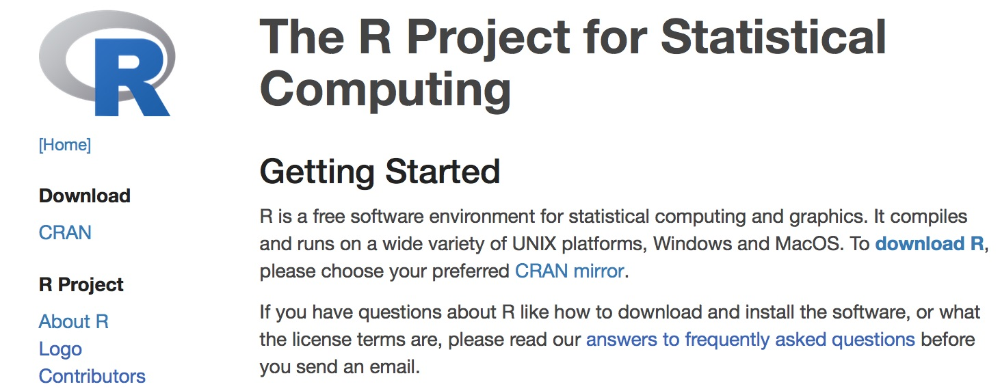

```{r setup, include=FALSE}
knitr::opts_chunk$set(echo = FALSE)
library(tidyverse)
library(gridExtra)
happinessdata2016 <- read_csv("happiness2016.csv")
```


## What is data science?

- <i class="fa fa-database fa-10x"></i> + <i class="fa fa-flask fa-10x"></i> = data science?

--

- <i class="fa fa-database fa-10x"></i> + <i class="fa fa-code fa-10x"></i> = data science?

--

- <i class="fa fa-database fa-10x"></i> + <i class="fa fa-user fa-10x"></i> + <i class="fa fa-code fa-10x"></i> = data science?

--

- <i class="fa fa-database fa-10x"></i> + <i class="fa fa-users fa-10x"></i> + <i class="fa fa-code fa-10x"></i> = data science?

--

<br>

Data science is an exciting discipline that allows you to turn raw data into understanding, insight, and knowledge. We're going to learn to do this in a `tidy` way -- more on that later!

## Welcome to STA130H1

- Login to Portal to get the location of your tutorial room (look under My Groups).

- Let's explore the [course website](http://sta130.utstat.utoronto.ca/)

# A Brief Introduction to R 

## What is R?



## R Coding basics

Go to console ...

```{r, echo=F, message=F, warning=F}
# required packages
library(readxl)
library(tidyverse)
```


## The data science process


<p style="clear: both;">
<figcaption>From *The Art of Data Science* by Roger Peng.

## Exploratory data analysis
- A critical aspect of learning from data, guided by what you want to learn

- Tukey: *“Exploratory data analysis is an attitude, a state of flexibility, a willingness to look for those things that we believe are not there, as well as those we believe to be there."*

- Goal is to understand the data: 
    - Summarize it.  Make comparisons
    - Check for errors (duplicates, miscoded values) and other problems (is the scale and format what you expected?)
    - Find missing values and outliers
    - Guide what models to use, what analysis to carry out to answer your questions, and what you expect to learn
    - Do you have the right data to answer your question?  do you have the right question?
  
## Tools for EDA

- Summary statistics (next week)
- Plots (today!)
    - looking for distribution of variables, that is, the pattern of variation in the values of a variable
    - looking for relationships between variables
    

There are other reasons to construct visualizations of data.  And principles for what makes a good and a not-so-good visualization.  (See Chapter 2 of the textbook.)

## Some data to explore

What influences your happiness?

We'll look at the data from the [World Happiness Report 2017](http://worldhappiness.report)

[Video](https://youtu.be/Se2gfFKp1Iw)

Data from the Gallup World Poll


```{r, echo=F, message=F, warning=F}
# load and process data
happinessurl <- "http://worldhappiness.report/wp-content/uploads/sites/2/2017/03/online-data-chapter-2-whr-2017.xlsx"
destfile <- "dataset.xlsx"
download.file(happinessurl, destfile)
happinessdata <- read_excel(destfile)
names(happinessdata) <- c("c1","country","year","life_ladder","logGDP","social_support","life_exp","freedom","generosity","corruption","positive_affect","negative_affect","confidence_govt","democratic","delivery","sd_ladder","sd_meanladder","GINI","GINIavg","GINIincome","trusted","trusted1","trusted2","trusted3","trusted4","trusted5","trusted6")
#View(happinessdata)
happinessdata <- happinessdata %>% select(country,year,life_ladder,logGDP,social_support,life_exp,freedom,generosity,corruption)
#View(happinessdata)

# add continents
#continenturl <- "https://commondatastorage.googleapis.com/ckannet-storage/2012-07-26T090250/Countries-continents-csv.csv"
#continentdata <- read_csv(continenturl) 
continentdata <- read_csv("Countries-Continents-csv.csv")
continentdata <- continentdata %>% mutate(continent=Continent) %>% mutate(country=Country) %>% select(continent,country)
#View(continentdata)

happinessdata <- left_join(happinessdata,continentdata)

# clean up missing continents
# happinessdata[is.na(happinessdata$continent),1]
happinessdata <- happinessdata %>% 
  mutate(continent=ifelse(country %in% c("Burkina Faso","Congo (Brazzaville)","Congo (Kinshasa)","Somaliland region"),"Africa",ifelse(country %in% c("Hong Kong S.A.R., China","Kosovo","Myanmar","Palestinian Territories","Russia","South Korea","Taiwan Province of China"),"Asia",ifelse(country=="North Cyprus","Europe",continent))))

# latest year
happinessdata2016 <- happinessdata %>% filter(year==2016)

# just North America / South America 
happinessdata_NA <- happinessdata %>% filter(continent=="North America")
happinessdata_SA <- happinessdata %>% filter(continent=="South America")
```

----

```{r}
glimpse(happinessdata)
```

```{r, echo=F, eval=F}
#glimpse(happinessdata2016)
#glimpse(happinessdata_NA)
#glimpse(happinessdata_SA)
```

## Types of variables

Numerical (or quantitative) variables:  

- Each value of a variable is from a numerical scale
- Values are ordered and differences are meaningful
- Examples: `life_ladder`, `log_GDP`, `life_exp`, etc.


Categorical variables:

- Each value is from a fixed set of possible values
- Possible values may or may not have an ordering
- Examples: `continent`

## Variables in the happiness data

### Measure of happiness:  

`life_ladder` — average response for a country to the question:   
*“Please imagine a ladder, with steps numbered from 0 at the bottom to 10 at the top.  The top of the ladder represents the best possible life for you and the bottom of the ladder represents the worst possible life for you.  On which step of the ladder would you say you personally feel you stand at this time?”*

----

### Six main contributing factors:  

1.  `log_GDP` -- GDP per capita measured on a log scale  
2.  `life_exp` --  healthy years of life expectancy at birth   
3.  `social_support`   
4.  `freedom`  
5.  `generosity`   
6.  `corruption` -- average response (0=no, 1=yes) to the questions:
    - “Is corruption widespread throughout the government or not?”
    - “Is corruption widespread within businesses or not?”


## Graphical exploration of (some of) the data

We’ll use the `ggplot2` package in `R` to construct our graphs. 

“gg” = Grammar of Graphics (Leland Wilkinson), a structure to combine graphical elements together to make a meaningful display of data


To use ggplot2 functions, need to first load the package `ggplot2`, which is also part of the `tidyverse` package.

```{r, eval=F}
library(tidyverse)
```

## ggplot2

In ggplot2, the structure of the code to produce most plots is

```{r, eval=F}
ggplot(data=[datset], aes(x=[var1], y=[var2])) +
  geom_xxx( ) +
  other options
```

### Some `ggplot` vocabulary:

- **aesthetic** -- mapping between a variable and where it will be represented on the graph (e.g., x axis, colour-coding, etc.) 

- **geometry** -- what are you plotting (e.g., points , lines, histogram, etc.)
    - Every plot must have at least one geometry and there is no upper limit 
    - You add a geometry to a plot using `+`
    
# Plots of one variable at a time

## A plot to show the distribution of a numerical variable: histogram

- Count the number of numerical values that lie within ranges, called bins.
- Bins are defined by their lower bounds (inclusive); the upper bound is the lower bound of the next bin
- Histogram displays the distribution (count (default) or `density`) of the numerical values in the bins 
- Horizontal axis is numerical, hence no gaps
- Just need one aesthetic, `x`
- Shape of the distribution: 
    - could be symmetric, left-skewed, right-skewed (skew is to the direction of the longer tail) 
    - number of modes (peaks): unimodal, bimodal, multimodal, uniform
    - unusual observations

----

```{r}
ggplot(data=happinessdata2016, aes(x=life_ladder)) + 
  geom_histogram()
```

----

```{r}
ggplot(data=happinessdata2016, aes(x=life_ladder)) + 
  geom_histogram(binwidth=1)
```

----

```{r}
ggplot(data=happinessdata2016, aes(x=life_ladder)) + 
  geom_histogram(binwidth=0.5)
```

----

```{r}
ggplot(data=happinessdata2016, aes(x=life_exp)) + 
  geom_histogram(binwidth=5)
```

----

```{r}
ggplot(data=happinessdata, aes(x=corruption)) + 
  geom_histogram(binwidth=.05)
```

## Another plot for a numerical variable: **boxplot**

Shows:  

- Line in the middle of the box:  
    - **median**: middle data value (50% of data values above, 50% below) 

- Edges of the box:  
    - **1st quartile**: value such that 25% of the data values are less it
    - **3rd quartile** -  value such that 75% of the data values are less it

- Length of the box is the Interquartile Range (IQR) = 3rd quartile - 1st quartile 
    — gives an indication of how spread out the data are
    
- Whiskers on the box extend to the largest data value that is within 1.5 * IQR beyond the 1st and 3rd quartiles

- Points beyond the whiskers are unusual (outliers?)

----

```{r}
ggplot(data=happinessdata2016, aes(x="Life Ladder", y=life_ladder)) + 
  geom_boxplot()
```

----

```{r, fig.height=2}
ggplot(data=happinessdata2016, aes(x=life_ladder)) + 
  geom_histogram(binwidth=0.5)
ggplot(data=happinessdata2016, aes(x="Life Ladder", y=life_ladder)) + 
  geom_boxplot() + coord_flip()
```

----

```{r, fig.height=2, warning=FALSE}
ggplot(data=happinessdata2016, aes(x=corruption)) + 
  geom_histogram(binwidth=0.05)
ggplot(data=happinessdata2016, aes(x="Corruption", y=corruption)) + 
  geom_boxplot() + coord_flip()
```

## Basic plots for a categorical variable: bar plot

- Displays the distribution of a categorical variable, the frequency of its different values   
- Heights (or lengths) of bars are proportional to the percent of individuals
- Bars have arbitrary (but equal) widths and spacings

----

```{r}
ggplot(data=happinessdata2016, aes(x=continent)) + 
  geom_bar()
```

----

An alternative, particularly useful for long labels

```{r}
ggplot(data=happinessdata2016, aes(x=continent)) + 
  geom_bar() +
  coord_flip()
```


# Looking at the relationship between two variables

----

### Side-by-side boxplots are useful to compare the distribution of a numerical variable across values of a categorical variable
```{r, fig.height=4}
ggplot(data=happinessdata2016, aes(x=continent, y=life_ladder)) + 
  geom_boxplot()
```

----

```{r}
ggplot(data=happinessdata2016, aes(x=continent, y=life_exp)) + 
  geom_boxplot()
```

----

```{r}
ggplot(data=happinessdata, aes(x=continent, y=corruption)) + 
  geom_boxplot()
```

----

### Scatterplots are useful to examine the relationship between two numerical variables

```{r, fig.height=4, warning=FALSE}
ggplot(data=happinessdata2016, aes(x=life_exp, y=life_ladder)) + 
  geom_point()
```

----

Use `labs()` to add titles and put better labels on axes.
```{r, warning=F, fig.height=4}
ggplot(data=happinessdata2016, aes(x=life_exp, y=life_ladder)) + 
  geom_point() +
  labs(x="Life expectancy (years)", y="Happiness (average on 10 point scale)")
```

----

Add a smoother to see the trend
```{r, warning=F, fig.height=3.5}
ggplot(data=happinessdata2016, aes(x=life_exp, y=life_ladder)) + 
  geom_point() +
  geom_smooth()
```

----

Change the smoother to a line of best fit (a 'regression' line)
```{r, warning=F, fig.height=4}
ggplot(data=happinessdata2016, aes(x=life_exp, y=life_ladder)) + 
  geom_point() +
  geom_smooth(method="lm")
```

----

### Relationship between happiness and perceived corruption

```{r, warning=FALSE, fig.height=4}
ggplot(data=happinessdata2016, aes(x=corruption, y=life_ladder)) + 
  geom_point()
```

----

Colour by continent.  
Make larger points.

```{r, warning=FALSE, fig.height=4}
ggplot(data=happinessdata2016, aes(x=corruption, y=life_ladder, colour=continent)) + 
  geom_point(size=2)
```

----

`theme` in `ggplot` controls some non-data plot elements

```{r, warning=FALSE, fig.height=4}
ggplot(data=happinessdata2016, aes(x=corruption, y=life_ladder, colour=continent)) + 
  geom_point(size=2) +
  theme_bw()
```

----

Identify the unusual point by plotting country name (text) instead of point
```{r, warning=FALSE, fig.height=4}
ggplot(data=happinessdata2016, aes(x=corruption, y=life_ladder, label=country)) + 
  geom_text(size=3)  
```

# Adding a 3rd variable to your plot

----

```{r, warning=FALSE, fig.height=4}
ggplot(data=happinessdata2016, aes(x=corruption, y=life_ladder, colour=continent)) + 
  geom_point(size=2)
```

How many variables are shown on this plot?

## Faceting 

- Dictionary: "Facet" is one side of something many-sided 
- `ggplot2`: Faceting creates separate graphs for subsets of data
- Allows comparisons among plots
- Two functions for creating small multiples:
    + `facet_wrap()`: define subsets as the levels of a single grouping variable
    + `facet_grid()`: define subsets as the crossing of two grouping variables
- Syntax: `facet_wrap(~[categoricalvariable])`
    - `R` uses `~` to separate left and right hand side of equations.  Left-side is optional.

----

###  Changes in happiness over time

`happinessdata` includes data for each year from 2005 to 2016

```{r, fig.height=4}
ggplot(happinessdata, aes(x=year, y=life_ladder)) + 
  geom_point() +
  facet_wrap(~continent)
```

----

```{r}
ggplot(happinessdata, aes(x=year, y=life_ladder, colour=continent)) + 
  geom_point() 
```

----

```{r}
ggplot(happinessdata, aes(x=year, y=life_ladder, colour=continent)) + 
  geom_point(shape=1) 
```

----

```{r}
ggplot(happinessdata, aes(x=year, y=life_ladder, colour=continent)) + 
  geom_point(shape=1, alpha=0.5) 
```

----

```{r}
ggplot(happinessdata, aes(x=year, y=life_ladder, colour=continent)) + 
  geom_jitter(width=0.1) 
```

----

### **A closer look at South America**

```{r, fig.height=4}
ggplot(happinessdata_SA, aes(x=year, y=life_ladder, colour=country)) + 
  geom_point() + 
  geom_line() 
```

---- 

```{r, fig.height=2.5}
ggplot(happinessdata_SA, aes(year, life_ladder)) + geom_point() + geom_line() + 
  facet_wrap(~country)
```

`R` is unhappy when there aren't multiple groups to connect with geom_line()

----

### **A closer look at North America**

```{r, fig.height=4}
ggplot(happinessdata_NA, aes(x=year, y=life_ladder, colour=country)) + 
  geom_point() + 
  geom_line() 
```

---

```{r, fig.height=3.5}
ggplot(happinessdata_NA, aes(x=year, y=life_ladder, colour=country)) + 
  geom_point() + 
  geom_line() + 
  facet_wrap(~country)
```