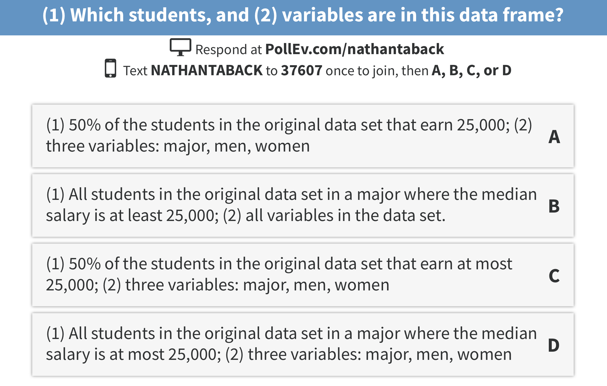

```{r setup, include=FALSE}
# R options
options(
  htmltools.dir.version = FALSE, # for blogdown
  show.signif.stars = FALSE,     # for regression output
  warm = 1
  )
# Set dpi and height for images
library(knitr)
opts_chunk$set(fig.height = 2.65, dpi = 300, warning=FALSE, message=FALSE) 
# ggplot2 color palette with gray
color_palette <- list(gray = "#999999", 
                      salmon = "#E69F00", 
                      lightblue = "#56B4E9", 
                      green = "#009E73", 
                      yellow = "#F0E442", 
                      darkblue = "#0072B2", 
                      red = "#D55E00", 
                      purple = "#CC79A7")
# For nonsese...
library(emo)
htmltools::tagList(rmarkdown::html_dependency_font_awesome())
library(tidyverse)
library(gridExtra)
library(mdsr)
happinessdata2016 <- read_csv("happiness2016.csv")
```


# Welcome back to STA130  `r emo::ji("happy")`
## Today's class

- Introduction to programming with R

--

- Numerical descriptions of the distribution of quantitative variable

---


## Today's Class

- Histograms and density functions
- Statistical data
- Tidy data
- Data wrangling
- Transforming data

# Histograms and Density Functions

## Histograms and Density Functions

- The histogram of a variable is a graphical method to vizualize the distribution of a single variable.
- To construct a basic histogram: 

(1) Divide the data into intervals (called bins).
(2) Count the number of observations that are contained in the bin.
(3) Plot rectangles with height equal to the count from (2) and width equal to the width of the bin.

## Histograms and Density Functions

- Different bin width will yield different histograms


```{r,warning=FALSE,message=FALSE,echo=FALSE, fig.height=2, fig.width=8}
p1 <- ggplot(data = happinessdata2016, aes(x = life_ladder)) + 
  geom_histogram(binwidth = 0.1) 
p2 <- ggplot(data = happinessdata2016, aes(x = life_ladder)) + 
  geom_histogram(binwidth = 1.0) 
grid.arrange(p1,p2,nrow = 1)
```

## Mathematical Definition of Histogram 

- The bins of the histogram are the intervals: $$[x_0+mh,x_0+(m+1)h).$$ 
$x_0$ is the origin, $m = \ldots,-1,0,1,\ldots$ indexes the bins, and $h = (x_0+(m+1)h) - (x_0+mh)$ is the bin width.

## Example - Mathematical Definition of Histogram 

```{r,echo=TRUE,comment=""}
dat <- data_frame(x = c(1,2,2.5,3,7))
dat$x
```

Let $x_0=0.5, h=0.25, m=1,\dots,29$

```{r,echo=TRUE,comment=""}
seq(0.5,7.5,by = 0.25)
```

The bins are: $[0.50,0.75),[0.75,1.00),[1.00,1.25),\ldots,[7.25,7.50).$

## Example - Mathematical Definition of Histogram 

- The bins can be used to construct rectangles with width $h=0.25$ and height $y$. 
- $y$ will be called density.
- The area of these rectangles is $hy$.
- We would like the area of these rectangles, $hy$, to be the same as the proportion of data in the bin.  This will make the sum of all areas equal 1.
- Let $n$ be the number of observations. Then, $$hy = \frac{\#\{X_i \text{ in bin} \}}{n} $$
- In this example, $n=5$, and $X_1=1,X_2=2,X_3=2.5,X_4=3,X_5=7.$

## Example - Mathematical Definition of Histogram 

```{r fig.height=3,comment=""}
p_count <- ggplot(data = dat, aes(x = x)) + 
  geom_histogram(breaks = seq(0.5,7.5,.25), closed = "left" )
p_relfreq <- ggplot(data = dat, aes(x = x,0.25*..density..)) + 
  geom_histogram(breaks = seq(0.5,7.5,.25), closed = "left" )
p_density <- ggplot(data = dat, aes(x = x,..density..)) + 
  geom_histogram(breaks = seq(0.5,7.5,.25), closed = "left" )
grid.arrange(p_count,p_relfreq,p_density,nrow = 2, ncol = 2)
#d <- ggplot_build(p)
#hist_dat <- data_frame(y = d$data[[1]]$y, count = d$data[[1]]$count, x = d$data[[1]]$x, xmin = d$data[[1]]$xmin, xmax = d$data[[1]]$xmax, density = d$data[[1]]$density)
#knitr::kable(hist_dat[1:3,])
```


## Mathematical Definition of Histogram

$$\hat f(x) = \frac{1}{hn} \#\{X_i \text{ in same bin as } x\}$$ is called the __histogram estimator__. 

$\hat f(x)$ is an estimate of the density at a point $x$.

To construct the histogram we have to choose an origin $x_0$ and bin width $h$.


## Choosing Origin and Bin Width in R

Same bin width but different origin

```{r, echo=FALSE, eval=TRUE}
dat <- data_frame(x = c(1,2,2.5,3,7))
p0.5 <- ggplot(data = dat, aes(x = x)) + 
  geom_histogram(breaks = seq(0.5,7.5,.25)) +
  labs(subtitle = "origin = 0.5, bin width = 0.25")
p2 <- ggplot(data = dat, aes(x = x)) + 
  geom_histogram(breaks = seq(2,7.5,.25)) +
  labs(subtitle = "origin = 2.0, bin width = 0.25")
grid.arrange(p0.5,p2,nrow = 1)
```


# Statistical data

## What is statistical data?

- Statistical data is obtained by observing (random) variables.
- A random variable can be given a precise mathematical definition that we will cover later in the course.
- In this class we will discuss examples.

## Observing a few variables on STA130 students 

- What is your height?
- How many years have been at UofT?
- What is your sex (male or female)?

Collecting this data will generate three variables: `height`, `years`, and `sex`.

## Enter variables on STA130 students

```{r,echo=TRUE}
height <- c()
years <- c()
sex <- c()
```

Put the variables into an R data frame.  

NB:  `data_frame` is the `tidyverse` version of base R `data.frame`.

```{r,eval=FALSE,echo=TRUE}
sta130_dat <- data_frame(height, years, sex)
```

We could have entred this in a spreadsheet program like MS Excel, saved it as a CSV file, then imported the file into R.

# Tidy data

## Tidy data

There are three interrelated rules which make a dataset tidy:

1. Each variable must have its own column.
2. Each observation must have its own row.
3. Each value must have its own cell.

## Tidy data

Which data set is tidy?

```{r,warning=FALSE,message=FALSE,echo=FALSE}
library(tidyverse)
table1
table3
```

## Tidy data

> "For a given dataset, it is usually easy to figure out what are observations and what are variables, but it is surprisingly difficult to precisely define variables and observations in general." (Wickham, 2014)

A general rule of thumb: 

- It is easier to describe functional relationships between variables (e.g., z is a linear combination of x and y, density is the ratio of weight to volume) than between rows. 

- It is easier to make comparisons between groups of observations (e.g., average of group a vs. average of group b) than between groups of columns.

(Wickham, 2014)

# Data wrangling

## Data wrangling

- The `ggplot` library implements a __grammer of graphics__.
- Similarily the `dplyr` library presents a grammer for data wrangling.

## The Economic Guide to Picking a Major 


> "...A college degree is no guarantee of economic success. But through their choice of major, they can take at least some steps toward boosting their odds."

## The Economic Guide to Picking a Major 

- The data used in the article is from the American Community Survey 2010-2012 Public Use Microdata Series.
- We can use the `fivethirtyeight` library in R.

## Data behind the article

```{r,echo=TRUE}
library(fivethirtyeight) # load the library
glimpse(college_recent_grads)
```

## Select variables/columns using `select()` 

To retrieve a data frame with only major, number of male and female graduates we use the `select()` function in the `dplyr` library.

```{r,echo=TRUE}
select(college_recent_grads,major, men,women)
```

## Select observations/rows using `filter()`

If we want to retrieve only those observations (rows) that pertain to engineering majors then we need to specify that the value of the `major` variable is Electrical Engineering.

```{r,echo=TRUE}
EE <- filter(college_recent_grads, major == "Electrical Engineering")
glimpse(EE)
```

NB:  `==` is a test for equality and is different than `=`.

## Combine `select()` and `filter()`

- We can drill down to get certain pieces of information using `filter()` and `select()` together.

- The `median` variable is median salary. 

```{r,echo=TRUE, eval=FALSE}
select(filter(college_recent_grads, median >= 60000), major, men, women)
```




## The pipe operator `%>%`

In the code:

```{r,eval=FALSE,echo=TRUE}
select(filter(college_recent_grads, median >= 60000), major,men,women)
```

filter is nested inside select.

The pipe operator allows is an alternative to nesting and yields easier to read code.  The same expression can be written with the pipe operator

```{r,eval=FALSE,echo=TRUE}
college_recent_grads %>% 
  filter(median >= 60000) %>% 
  select(major, men, women)
```

## Create new variables from existing variables using `mutate()`

What percentage of graduates from each major where the median earnings is at least $60,000 are men ?

```{r,echo=TRUE,eval=FALSE}
college_recent_grads %>% 
  filter(median >= 60000) %>% 
  select(major, men, women) %>% 
  mutate(total = men + women, pct_male = round((men / total)*100, 2))
```

Compare to nested code:


```{r,echo=TRUE,eval=FALSE}
  mutate(select(filter(college_recent_grads,median >= 60000), 
                major, men, women), 
         total = men + women, pct_male = round((men / total)*100, 2))
```


## Create new variables from existing variables using `mutate()`

```{r}
knitr::kable(college_recent_grads %>% 
  filter(median >= 60000) %>% 
  select(major, men, women) %>% 
  mutate(total = men + women, pct_male = round((men / total)*100, 2)))
```

## Create new variables from existing variables using `mutate()`

- Suppose that we would like to create a categorical variable to identify majors with 45% and 55% women (ie., approximately equal numbers of males and females).
- We can use `ifelse()` in a `mutate()` statement.

```{r,echo=TRUE}
college_recent_grads %>% 
  select(major, men, women) %>% 
  mutate(total = men + women, pct_female = round((women / total)*100, 2), 
         male.bias = ifelse(pct_female >= 45 & pct_female <= 55, "No","Yes")) %>%
  select(major,male.bias)
```

## Rename variables using `rename()`

- It's considered bad practice in R to use periods in variable names.
- We can use `rename()` to change the name of `sex.equal` to `sex_equal`.

```{r,echo=TRUE,cache=TRUE,size='smallsize'}
my_college_dat <- college_recent_grads %>% 
  select(major, men, women, median) %>% 
  mutate(total = men + women, pct_female = round((women / total)*100, 2), 
         sex.equal = ifelse(pct_female >= 45 & pct_female <= 55, "No","Yes")) %>%
  select(major,sex.equal, median)

my_college_dat <- my_college_dat %>% 
  rename(sex_equal = sex.equal, salary_median = median)
glimpse(my_college_dat)
```

## Sort a data frame using `arrange()`

```{r,echo=TRUE}
my_college_dat %>% 
  arrange(salary_median) %>% 
  select(major, salary_median) %>% 
  arrange(desc(salary_median))
```


## Summarize a data frame using `summarize()`

The average number of female grads and the total number of majors in the data set.

```{r,echo=TRUE}
college_recent_grads %>% 
  select(major, men, women) %>% 
  summarise(femgrad_mean = mean(women), N = n())
```

## Summarize groups in a data frame using `summarize()` and `group_by()`

The median salary in majors with 45%-55% female students. 

```{r,echo=TRUE}
my_college_dat %>% 
  group_by(sex_equal) %>%
  summarise(median(salary_median))
```


# Combining Multiple Tables

## Sentiment of Trump's Tweets

- Donald Trump likes to tweet a lot.  
- Some tweets have an angry sentiment or contain insults, and some are not.  
- Trump supposedly used to send tweets from a [Samsung Galaxy](https://www.theatlantic.com/politics/archive/2017/03/a-bot-that-detects-when-donald-trump-is-tweeting/521127/) when he is [insulting people, places, and things](https://www.nytimes.com/interactive/2016/01/28/upshot/donald-trump-twitter-insults.html?mcubz=0&_r=0), from other devices such as an iPhone when he is not.
- Trump's last tweet from Android were March 25, 2017


## Trump's Tweets

A data frame with Trump's Tweets.

```{r,message=FALSE,warning=FALSE,echo=TRUE}
trumptweets <- read_csv("trumptweets.csv") #import from csv file
glimpse(trumptweets)
```

## Trump's tweets

```{r,echo=TRUE,warning=FALSE,message=FALSE, fig.height=3, message=FALSE, warning=FALSE, r,echo=TRUE}
trumptweets %>% 
  count(word) %>% 
  mutate(word = reorder(word,n)) %>% 
  top_n(20) %>% 
  ggplot(aes(word, n)) + geom_col() + coord_flip()  +
  labs(x = "Word",y = "Number of times word ocurres in a Tweet")
```

## Sentiment Lexicon

- Several lexicons (dictionaries) have been developed that categorize words according to sentiment (feeling or emotion).
- The `tidytext` library contains several lexicons.

```{r,echo=TRUE,warning=FALSE}
library(tidytext)
sentiments
```

## NRC Lexicon

- The nrc lexicon categorizes words in a binary fashion (“yes”/“no”) into categories of positive, negative, anger, anticipation, disgust, fear, joy, sadness, surprise, and trust.   
- The `getsentiments()` function provides a way to get specific sentiment lexicons without the columns that are not used in that lexicon.

## NRC Lexicon

```{r,echo=TRUE}
get_sentiments("nrc")
```

## Sentiment of Words used in Tweets

- To examine the sentiment of the words Trump used in tweets we need to join the data frame containing the NRC lexicon and the data frame of Trump's words used in tweets.

- `inner_join(x,y)`: return all rows from x where there are matching values in y, and all columns from x and y. If there are multiple matches between x and y, all combination of the matches are returned.


```{r, echo=TRUE,warning=FALSE,message=FALSE}
trumptweets %>% inner_join(get_sentiments("nrc"))
```

## Sentiment of Words used in Tweets

```{r,echo=TRUE,message=FALSE}
trumptweets %>% 
  inner_join(get_sentiments("nrc")) %>% 
  group_by(sentiment,source) %>% 
  summarise(n=n()) %>% 
  mutate(pct= round(n/sum(n)*100,2)) %>%
  arrange(desc(pct))
```


## Sentiment of Words used in Tweets

```{r, echo=TRUE,eval=TRUE,message=FALSE, echo=FALSE}
trumptweets %>% 
  inner_join(get_sentiments("nrc")) %>% 
  group_by(sentiment,source) %>%
  count(sentiment) %>%
  ungroup() %>%
  mutate(sentiment = reorder(sentiment,n)) %>%
  group_by(sentiment, source) %>%
  ggplot(aes(sentiment,n)) + geom_col(aes(fill = source), position = "dodge") + coord_flip() +
  labs(y = "Number of words in Tweets",x = "NRC Sentiment")
```


## Join two tables together

- In the `dplyr` library there are several other ways to join tables: `left_join()`, `right_join()`, `full_join()`, `semi_join()`, `anti_join()` .

- See `dplyr` [documentation](http://dplyr.tidyverse.org/reference/join.html).


```{r,eval=FALSE}
library(rvest)
url <- "https://www.canada.ca/en/public-health/services/surveillance/respiratory-virus-detections-canada/2017-2018/respiratory-virus-detections-isolations-week-1-ending-january-6-2018.html"
 
flu_dat <- url %>% read_html() %>% html_nodes(xpath = '/html/body/main/div[1]/div[2]/details[1]/table') %>% html_table()
fludat <- flu_dat[[1]] #%>% filter(row_number() < 42)

```


# Transforming data

## Statistical Transformations

- In statistical anaysis it's often necessary to transform data.
- Transforming data takes each value of a variable $x_i$ and transforms it into $f(x_i)$:

$$x_i \mapsto f(x_i).$$
- Common transformations include: $f(x)=\ln(x)$, and $f(x)=x^p, \mbox{ }p \in \mathbb{R}.$  For example, if $p=1/2$ then $f$ is the square-root transformation.

## Logarithmic transformation

- Logarithmic transformation refers to the natural logarithm: $$y=\log_e(x) \iff \exp(y)=e^y=x$$

```{r}
ggplot(data.frame(x = c(0.05, 50)), aes(x)) +
  stat_function(fun = log, geom = "line") + labs(y="ln(x)") + theme_bw()
```

## Transforming Variables in R

The relationship between Salary (`median`) and percentage of male graduates.

```{r, echo=TRUE,fig.height=3}
college_recent_grads %>% 
  ggplot(aes(x = men / total, y = median)) + geom_point()
```

## Transforming Variables in R

The same plot but on the log-log scale.

```{r, echo=TRUE, fig.height=3}
college_recent_grads %>% 
  mutate(log_men = log(men / total), log_salary = log(median)) %>%
  ggplot(aes(x = log_men, y = log_salary)) + geom_point()
```