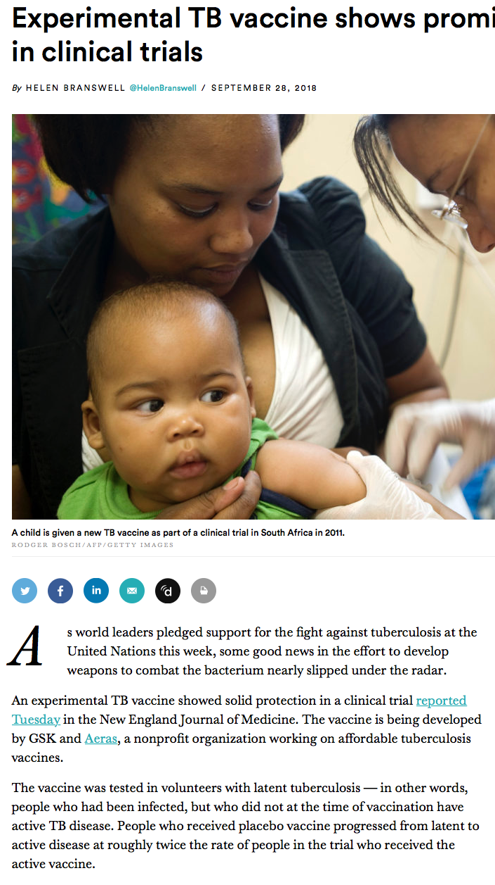

```{r setup, include=FALSE}
# R options
options(
  htmltools.dir.version = FALSE, # for blogdown
  show.signif.stars = FALSE,     # for regression output
  warm = 1
  )
# Set dpi and height for images
library(knitr)
opts_chunk$set(fig.height = 2.65, dpi =300, warning=FALSE, message=FALSE) 
# ggplot2 color palette with gray
color_palette <- list(gray = "#999999", 
                      salmon = "#E69F00", 
                      lightblue = "#56B4E9", 
                      green = "#009E73", 
                      yellow = "#F0E442", 
                      darkblue = "#0072B2", 
                      red = "#D55E00", 
                      purple = "#CC79A7")
# For nonsese...
library(emo)
library(tidyverse)
library(gridExtra)
library(mdsr)
htmltools::tagList(rmarkdown::html_dependency_font_awesome())

```


```{r, echo=FALSE, warning=FALSE, message=FALSE}
library(tidyverse)
```


## Today's Class

Answering the question:   
**is something we observe in data meaningful, or could it simply be due to chance?**

Examples for:

- a single proportion

Next week:

- extend to more situations

Recommended reading:  
Sections 2.3.1, 2.3.2, 2.3.7 and 2.4 of [*Introductory Statistics with Randomization and Simulation* from OpenIntro](https://www.openintro.org/stat/textbook.php?stat_book=isrs)  
(a free open-source textbook)


---


## Statistical Inference

- A **statistical inference** helps to make conclusions or decisions using data.

--

- An *inference* in general is an uncertain conclusion.

--

- Two things mark out **statistical inference**: 

   * the information on which they are based is statistical (i.e., subject to randomness); 
   * our conclusion is uncertain, and attempt to measure the uncertainty involved.

---

.pull-left[]

.pull-right[]


---
## Statistical Inference

Statistical inference can answer questions such as:

1. If more people buy the product after seeing two versions of the same web page (A and B) is the difference due to chance or due to different versions of the web page?

--

2. If less people who received the experimental TB vaccine are infected with TB compared to people that didn't receive the vaccine is the difference due to chance or due to receiving the vaccine? 

--

Sometimes inference isn't appropriate.  For example, if we have data for all possible observations, there may be nothing to infer. 

---

## Statistical Inference
  
**Significance Testing**  

"If I calculate *something* in my data, say a difference between two groups or a relationship between two variables or a value that is different than what I'd expect then, could this be simply due to chance, or is it an actual real difference or relationship?"

---

# Significance Testing for a Single Proportion


---

## Kissing the Right Way 

.pull-left[


Rodin's sculpture [*The Kiss*](http://www.musee-rodin.fr/en/collections/sculptures/kiss)]

.pull-right[
- [Güntürkün (2003)](http://www.nature.com/news/2003/030213/full/news030210-7.html) recorded the direction kissing couples tilted their heads. 
- Of the 124 couples he observed, 80 turned their heads to the right.
- 64.5% of couples tilted their heads to the right.  
- Is this evidence of a right-side preference?

**What would you expect to see if couples had no preference?**
]
---

## What would you expect to see if couples had no preference?

- In order to explore what we might expect to see if couples had no preference for tilting their heads to the left or right when kissing, we'll use **simulation**. 

--

- Randomly generate data that under the assumption that couples have no preference (i.e.  they are equally likely to tilt their heads to the left or right.)

--

- We'll do this many times to see what values are possible under the assumption of no preference.

**What simple activity simulates an event that can occur one way or another with equal probability?**

---

## Flip a coin once
```{r}
sample(c("heads","tails"), 
       size = 1, 
       prob = c(0.5, 0.5))
```

---

## Flip a coin 124 times 

The R code below simulates 124 flips of a coin or *simulating* 124 flips of a coin. 

```{r}
# randomly generate 124 flips of a coin -- a "simulation"
# probability is c(0.5, 0.5) by default
n_flips <- 124
coin_flips <- sample(c("heads", "tails"), 
                size = n_flips, 
                replace = TRUE)   
```


```{r}
data.frame(coin_flips) %>% head() #result of first 6 flips
table(coin_flips) #counts number of heads and tails
```


---

## Calculate the proportion of heads

Which of the 124 flips are heads?

```{r}
coin_flips == "heads"
```

---

## Calculate the proportion of heads

Count the number of heads (count how often `flips == "heads"` is TRUE).

```{r}
sum(coin_flips == "heads")
```

Calculate the proportion of heads in the simulation.

```{r}
p_heads <- sum(coin_flips == "heads") / n_flips
p_heads
```

---

## Recall: how to reproduce 'randomness' in R?

- Simulations use functions in `R` that produce (apparently) random outcomes (for example, `sample`).

--

- We can force such a function to produce the same outcome every time by setting a parameter called the "seed".

--

- The seed can be any integer.

--

- I'll do that now, so that you can reproduce my results exactly with the following command:
```{r, eval=F}
set.seed(130)
```

---

## Simulate 124 head tilts when kissing, assuming that left or right is equally likely

.small[
Set the random seed to get the same answer every time
```{r sim1, echo=T}
set.seed(130) 
n_observations <- 124  
```

Create an empty vector to store the results to store 1000 results, initially it's filled with missing values (NAs).

```{r, cache=TRUE}
simulated_stats <- rep(NA, 1000)
sim <- sample(c("right", "left"), 
              size = n_observations, 
              replace = TRUE)
sim_p <- sum(sim == "right") / n_observations
sim_p
simulated_stats[1] <- sim_p
```

The last line adds the new simulated value to the first entry in the vector of results.
]

---

Turn results into a data frame.

```{r, warning=F, message=F}
sim1 <- data_frame(p_right = simulated_stats)
```

Plot using `ggplot`
```{r}
sim1 %>% ggplot(aes(x=p_right)) + 
  geom_dotplot() + 
  xlim(0.3, 0.7) + 
  ylim(0, 10)
```

---

## Add another simulation

```{r, echo=FALSE, warning=F, message=F}
new_sim <- sample(c("right", "left"), size = n_observations, replace = TRUE)
sim_p <- sum(new_sim == "right") / n_observations
sim_p

# add the new simulated value to the first entry in the vector of results
simulated_stats[2] <- sim_p

# turn results into a data frame
sim2 <- data_frame(p_right = simulated_stats)

# plot
ggplot(sim2, aes(x = p_right)) + geom_dotplot() + xlim(0, 1) + ylim(0, 10)
```

---

## And another simulation

```{r, echo=FALSE, warning=F, message=F}
new_sim <- sample(c("right", "left"), size = n_observations, replace = TRUE)
sim_p <- sum(new_sim == "right") / n_observations
sim_p

# add the new simulated value to the first entry in the vector of results
simulated_stats[3] <- sim_p

# turn results into a data frame
sim3 <- data_frame(p_right = simulated_stats)

# plot
ggplot(sim3, aes(x=p_right)) + geom_dotplot() + xlim(0, 1) + ylim(0, 10)
```

---

## `for` loops

- Automate the process of generating many simulations

--

- Evaluate a block of code for each value of a sequence

--

- The following `for` loop will evaluate SOME CODE 1000 times, for `i=1` and `i=2` and ... and `i=1000`

--

- Note that SOME CODE is within curly brackets

```{r, eval=F}
for (i in 1:1000)
{
  SOME CODE
}
```

---

Set values for simulation.

```{r, warning=F, message=F}
n_observations <- 124 # number of obeservations
repetitions <- 1000 # 1000 simulations
simulated_stats <- rep(NA, repetitions) # 1000 missing values
set.seed(101)
```

Automate simulation with a `for` loop and turn results into a data frame.

```{r, warning=FALSE, message=FALSE}
for (i in 1:repetitions)
{
  new_sim <- sample(c("right", "left"), 
                    size = n_observations, 
                    replace = TRUE)
  sim_p <- sum(new_sim == "right") / n_observations
  # add the new simulated value to the ith entry 
  # in the vector of results
  simulated_stats[i] <- sim_p
}
sim <- data_frame(p_right = simulated_stats)
```


---

Plot results

```{r, warning=F, message=F}
sim %>% ggplot(aes(x = p_right)) + 
  geom_histogram(binwidth = 0.02, colour = "black", fill = "grey")
```

---
## How unusual is a value of 0.645, if tilting to the right or left is equally likely?

```{r kissing_samples, warning=F, message=F, fig.height=1.5}
sim %>% ggplot(aes(p_right)) + 
  geom_histogram(binwidth = 0.02, colour = "black", fill = "grey") +
  geom_vline(xintercept = 0.645, color = "red") + 
  geom_vline(xintercept = 0.355, color = "blue") +
  labs(x = "Simulated values of proportion who kiss right")
```


---

## How unusual is a value of 0.645, if tilting to the right or left is equally likely?

This includes values that are $>= 0.645$ as well as values that are $<=0.355$ since 0.355 is as far from 0.5 as 0.645.

**Calculate the proportion of our simulated observations that are as unusual or more unusual than 0.645:**

--

In `R`, the vertical bar `|` means **or**.

```{r}     
sim %>% 
filter(p_right >= 0.645 | p_right <= 0.355) %>%
summarise(p_value = n() / repetitions)
```
---

# The Logic of Hypothesis Testing 

---

## 1. The hypotheses

Two claims:

1. Couples are equally likely to tilt to the right or left.  This is the **null hypothesis**, written $H_0$. The proportion who kiss to the right is one-half.
$$ H_0: p=0.5 $$

--

2. Couples are more likely to prefer one side.  This is the **alternative hypothesis**, written $H_A$ (or $H_a$ or $H_1$).  
For the kissing example, if there is something going on, the proportion who kiss to the right should be something other than one-half.
$$H_A: p \ne 0.5$$


---

## 2. Parameters, Statistics, Test Statistics
.pull-left[
A **parameter**: "true" value of what we're interested in, typically, because it's what holds for the population.  

A **statistic** is a number that describes the sample. The value of a statistic will changes from sample to sample.  

A **test statistic** measures the compatiability between null hypothesis and the data.

]

.pull-right[
In the kissing example:  

**Parameter**: $p$: the true proportion of people who kiss to the right  

**Statistic**: $\hat{p}$: the proportion of people who kiss to the right. The value of a statistic can be different from sample to sample.

The **test statistic** is a number, calculated from the data. For the kissing example, the test statistic we'll use is $\hat{p}= 80/124 = 0.645$
]

---

## 3. Simulate what the null hypothesis predicts will happen

The **distribution** of the statistic is the pattern of values it could be, including an indication of how likely those values are to occur.

--

A simulation is a way to explore random events, such as what some data or a test statistic could look like under certain assumptions. By observing many simulated outcomes, we can see what values are possible and the distribution of these possible values.

--

We want to know the distribution of what the test statistic could be if the null hypothesis were true. 

--

To get an estimate of this, simulate many possible values of the statistic under the assumption that the null hypothesis is true.  

This is the **empirical distribution** of the test statistic under the null hypothesis.

---

## 4. The P-value

- Assuming that the null hypothesis is true, the **P-value** is the probability of observing data that are **at least as unusual** as the sample data.  

--

- We estimate the P-value as the proportion of observations in the empirical distribution that yield a statistic as extreme or more extreme than the test statistic calculated from our data.

---

## 4. The P-value

- What does "as extreme or more extreme" mean?  

--

   - Values that are as far away or even farther from the null hypothesis value.  
   
--
   
For the kissing example:
- the null hypothesis value: $p=0.5$

--

- the observed estimate from the data: $\hat{p}=0.645$

--

- values at least as unusual as the data values: all values **greater than or equal to 0.645** and all values **less than or equal to 0.355**

--

- This is a **two-sided test** because it considers differences from the null hypothesis that are both larger and smaller than what you observed.  
(It is also possible to carry out one-sided tests.  They are useful in some specific applications.)

---

## 5. Make a conclusion


- P-values are probabilities so are between 0 and 1. Small probabilities correspond to events that are unlikely to happen and large values correspond to events that are likely to happen.

--

- A large P-value means the data are consistent with the null hypothesis.

--

- A small P-value means the data are inconsistent with the null hypothesis.  A **statistically significant** result is associated with a small P-value.

---
## 5. Make a conclusion

Some guidelines for how small is small:

| P-value                 | Evidence                           |
|-------------------------|------------------------------------|
| p-value > 0.10          | no evidence against $H_0$          |
| 0.05 < p-value < 0.10   | weak evidence against $H_0$        |
| 0.01 < p-value < 0.05   | moderate evidence against $H_0$    |
| 0.001 < p-value < 0.01  | strong evidence against $H_0$      |
| p-value < 0.001         | very strong evidence against $H_0$ |


---

## Simulation results and P-value for kissing ex.

```{r kissing_samples, echo=F, warning=F, message=F, fig.height=2.5}
```

```{r, echo=F}     
sim %>% 
filter(p_right >= 0.645 | p_right <= 0.355) %>%
summarise(p_value = n() / repetitions)
```

---

## Conclusion for the Kissing Example

Since the P-value is 0.001 we conclude that we have we have strong evidence against the null hypothesis.  The data provide convincing evidence that people are more likely to tilt their heads to one direction when they kiss.

---

## Another example: Is a coin biased? 

.pull-left[
<iframe src="https://giphy.com/embed/yIRdeZAnRxFeg" width="480" height="150" frameBorder="0" class="giphy-embed" allowFullScreen></iframe><p><a href="https://giphy.com/gifs/movie-no-country-for-old-men-yIRdeZAnRxFeg">via GIPHY</a></p>

- In 1986, mathematician Joseph Keller, now an emeritus professor at Stanford, proved that one fair way to toss a coin is to throw it so that it spins perfectly around a horizontal axis through the coin's center.

]

.pull-right[

- Such a perfect toss would require superhuman precision. Every other possible toss is biased, according to an analysis described on Feb. 14 in Seattle at the annual meeting of the American Association for the Advancement of Science.

- A researcher tossed an American quarter 2000 times and obtained 1123 heads.  Is this evidence that the coin is biased?
]
---

## Steps to testing whether the data are consistent with a biased coin

1. Formulate null and alternative hypotheses.
2. Calculate a test statistic from the data.
3. Simulate many values of what the test statistic could possibly have been if the null hypothesis were true.
4. Calculate the P-value.
5. Make a conclusion.

---

## What would be appropriate null and alternative hypotheses to test if the coin is biased?

$H_0$:


$H_A$:

---

## What would be an appropriate test statistics?

The data: 
The researcher flipped the coin 2000 times and obtained 1123 heads.

---

## Simulate many values of what we'd observe if the null hypothesis were true

Here is the code for the kissing example.  What values do we need to change?

```{r, eval=F}
repetitions <- 1000
simulated_stats <- rep(NA, repetitions) # 1000 missing values

n_observations <- 124

test_stat <- 80/124

set.seed(101)
for (i in 1:repetitions)
{
  new_sim <- sample(c("right", "left"), 
                    size=n_observations, 
                    replace=TRUE)
  sim_p <- sum(new_sim == "right") / n_observations
  simulated_stats[i] <- sim_p
}
```

---

Here is more code for the kissing example.  What values do we need to change?

```{r, eval=F}
sim <- data_frame(p_right = simulated_stats)

ggplot(sim, aes(p_right)) + 
geom_histogram(binwidth=0.02, colour = "black", fill = "grey") +
geom_vline(xintercept = 0.645, color="red") +
  geom_vline(xintercept = 0.355, color="blue") 

sim %>% 
filter(p_right >= 0.645 | p_right <= 0.355) %>%
summarise(p_value = n() / repetitions)
```

---

## Results for biased coin example

```{r}
set.seed(130) 
repetitions <- 1000
simulated_stats <- rep(NA, repetitions) # 1000 missing values

n_observations <- 2000

test_stat <- 1123/2000
other_extreme <- 0.5 - (1123/2000 - 0.5)

set.seed(101)
for (i in 1:repetitions)
{
  new_sim <- sample(c("heads", "tails"), 
                    size = n_observations,
                    prob = c(0.5,0.5), 
                    replace = TRUE)
  sim_p <- sum(new_sim == "heads") / n_observations
  simulated_stats[i] <- sim_p
}
```

---
```{r}
sim <- data_frame(p_heads = simulated_stats)

ggplot(sim, aes(p_heads)) + 
geom_histogram(binwidth = 0.01, colour = "black", fill = "grey") +
geom_vline(xintercept = test_stat, color = "red") +
  geom_vline(xintercept = other_extreme, color = "blue") 
```

---

```{r}
sim %>% 
filter(p_heads >= test_stat | p_heads <= other_extreme) %>%
summarise(p_value = n() / repetitions)
```

---

## Conclusion

The researcher observed Mendel observed 1123 heads in 2000 coin tosses, a proportion of `r 1123/2000`.

Assuming the probability of head is 0.50, the probability of observing a proportion that differs from 0.50 as much or more than `r 1123/2000` is 0.0.  Therefore we have strong evidence that the coin is biased. 

---

## How many simulations is enough?

- In our examples, we've looked at 1000 simulated values assuming the null hypothesis is true, to compare to the value of our test statistic.
- In practice, the number of simulations is more typically on the order of 10,000.
- But that can take a long time to run.

---

## A mathematical note 

[Not responsible for on test and exam.]

- You could determine the P-value exactly using a *binomial* probability model.  
- A binomial probability model is used to count the number of "successes" in $n$ independent trials, where each trial has two possible outcomes: "success" with probability $p$ or "failure" with probability $(1-p)$.  
- The probability of $k$ successes in $n$ trials is
$$ \left ( \begin{matrix}{n \\ k}\end{matrix} \right ) p^k (1-p)^{n-k}$$

You'll study binomial probability models in second year statistics courses.
