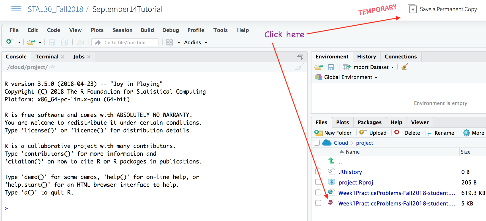

```{r setup, include=FALSE}
knitr::opts_chunk$set(echo = TRUE)
```

# September  Tutorial

## Answer the questions using RStudio Cloud (recommended)

1. Go to R Studio Cloud [workspace for this assignment](https://rstudio.cloud/spaces/3186/join?access_code=b0A03f8ziEjE1fmGJ3CTYyhab1n%2FR5yB1EYBLczh).


2. Click on projects.


3. Click on September28Tutorial.

4. When you access the project created by someone else, RStudio Cloud automatically creates a temporary copy of the original project for you. You can play with and make edits to it, but none of your changes will be reflected in the original. If you’d like to keep the changes you’ve made, just save a copy of the project for yourself by pressing the Save a Permanent Copy button.


5. Look for the file "Week4PracticeProblems_questions.Rmd" under the Files tab then click on it to open.

6. Change the subtitle to "Week 4 Practice Problems Solutions" and change the author to your name and student number.

**NB: The screenshot below is for week1 problems, but it's the same idea.**




Remember that [R code chunks](http://rmarkdown.rstudio.com/authoring_rcodechunks.html) can be inserted directly into the notebook by choosing Insert R from the Insert menu (see Using [R Markdown for Class Assignments](https://ntaback.github.io/UofT_STA130/Rmarkdownforclassreports.html)). In addition this R Markdown [cheatsheet](http://www.rstudio.com/wp-content/uploads/2016/03/rmarkdown-cheatsheet-2.0.pdf), and [reference](http://www.rstudio.com/wp-content/uploads/2015/03/rmarkdown-reference.pdf) are great resources as you get started with R Markdown. 


## Answer the questions using RStudio installed on your own computer

Download R Markdown questions file directly into RStudio by typing the following code into the RStudio console window.   

```{r,eval=FALSE}
file_url <- "https://raw.githubusercontent.com/ntaback/UofT_STA130/master/Fall2018/week4/tutorial/Week4PracticeProblems_questions.Rmd"
download.file(url = file_url , destfile = "Week4PracticeProblems-student_temp.Rmd")
```

You will need to install several libraries such as `tidyverse`, and `mosaic` to complete the questions.

Look for the file "Week3PracticeProblems_student.Rmd" under the Files tab then click on it to open.