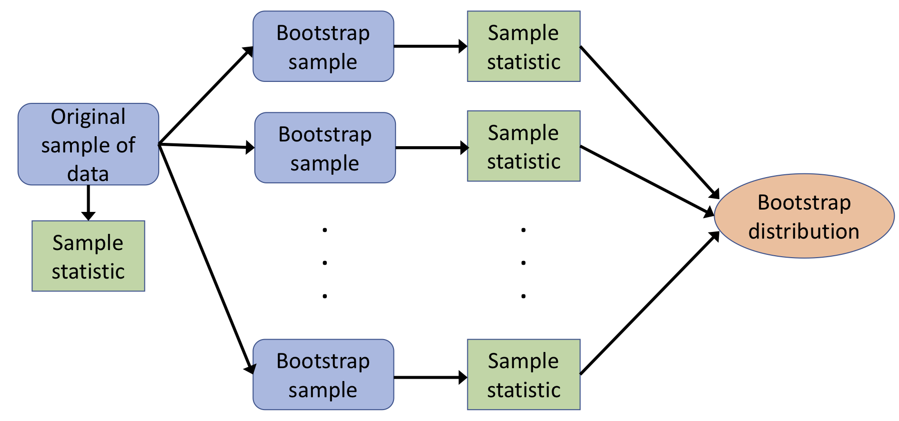

```{r setup, include=FALSE}
# R options
options(
  htmltools.dir.version = FALSE, # for blogdown
  show.signif.stars = FALSE,     # for regression output
  warm = 1
  )
# Set dpi and height for images
library(knitr)
opts_chunk$set(fig.height = 2.65, dpi =300, warning=FALSE, message=FALSE) 
# ggplot2 color palette with gray
color_palette <- list(gray = "#999999", 
                      salmon = "#E69F00", 
                      lightblue = "#56B4E9", 
                      green = "#009E73", 
                      yellow = "#F0E442", 
                      darkblue = "#0072B2", 
                      red = "#D55E00", 
                      purple = "#CC79A7")
# For nonsese...
library(mdsr)
library(emo)
library(tidyverse)
library(gridExtra)
htmltools::tagList(rmarkdown::html_dependency_font_awesome())

```


```{r, echo=FALSE, warning=FALSE, message=FALSE}
library(tidyverse)
```

## Final Project Information

- Information now posted on the website
- Statistical analysis of data from The World Factbook: focusing on internet usage in different regions of the world
- Work in groups of 3-4 students (groups made within your tutorial sections)
- Present your results as a poster presentation
   - Thursday December 6, 2018 during your regular lecture time (10:10-12:00 or 2:10-4:00)
   
---
   
## Plan for today's class

### Big idea:
*We estimate a characteristic of a population from incomplete, imperfect observed data.  
<br>
What is a range of plausible values for what it could actually be?*

--

### Important concepts:

1. Population parameters and sample statistics to estimate them
2. Sampling distribution
3. Bootstrap sampling distribution
4. Confidence intervals


---

## Review of percentiles

*Definition*

For a number \texttt{p} between 0 and 100,  the \texttt{p}th percentile is the smallest value that is larger or equal to \texttt{p}% of all the values

- Median ($Q_2$): 50th percentile
- First quartile ($Q_1$): 25th percentile
- Third quartile ($Q_3$): 75th percentile

[poll-everywhere questions - picture of boxplot and questions about percentiles]
---

## Inferential thinking for estimation 

- Imagine we have a *real world* where we observe data and a *theoretical world* (a population or scientific model) that we want to make conclusions about

- Inference connects what we observe in the real world to what we can say about the theoretical world

- So far: The null hypothesis gave us a model for the theoretical world

- Today: No hypothesis that assumes anything about the theoretical world
     - let the data speak for itself
     
---

## Populations and samples

- A **population** is a complete collection of individuals that we are interested in
- A **sample** is a subset of a population
- Our goal: We want to understand something about the population (theoretical world)
   - We can't measure every individual in the population
   - What can we do instead?
   
--

- Key property of a good sample?
    - Chosen **randomly** from the population
    - This is to ensure it is representative of the population
   
   
[activity?]

---

## Parameters and statistics

Recall: in weeks 4 and 5, we talked about **parameters** and **statistics**

Fill in the blanks:

  - Theoretical world:

  - Real world (i.e. from our data):

---

## Parameters and statistics

Q1. TRUE or FALSE? 
<br>
If you have relevant data for each individual in the population, you can calculate the true value of the parameter.
--
<br>

Q2. TRUE or FALSE?
<br>
In general, we know the true value of the parameter.
--
<br>

Q3. TRUE or FALSE?
<br>
A statistic is calculated from observed data and is an **estimate** of the parameter.
--
<br>

Q4. TRUE or FALSE?
<br>
Every random sample drawn from the population will give the same value of the statistic.

---
# Sampling distributions

---

## Sampling from a population

- We will begin this section by assuming that we have data for all the individuals in a population
    - This assumption is generally unrealistic!!
    
- Our population: Either flights, or data from STA130 students in class today

- Goal: 
   - draw various random samples from the population
   - for each random sample, calculate the *statistic* to estimate a *parameter* of interest
   - look at how the estimate varies across samples
   

---

### Example: 2013 flights from New York to San Francisco

Population: All flights leaving New York for San Francisco (airport code SFO) in 2013

Data stored in a data frame called SF

We're interested in the numerical variable arr\_delay

```{r, eval=TRUE, echo=TRUE}
library(tidyverse)
library(nycflights13)
SF <- flights %>% filter(dest == "SFO" & !is.na(arr_delay))
```

---

## Some value calculated from our population

```{r}
SF %>% summarise(mean_delay=mean(arr_delay),
                 median_delay=median(arr_delay),
                 max_delay=max(arr_delay),
                 perc98_delay=quantile(arr_delay, 0.98))
```

Are these *parameters* or *statistics*?


---

## Samples of size 25

Suppose we only have a sample of 25 flights from our population

The function sample\_n in dplyr can be used to draw samples 
  - easy way to get a random of n rows from a data frame (one line only, using piping)
  - default is to sample without replacement

```{r, echo=FALSE, eval=TRUE}
set.seed(2018)
```


```{r, eval=TRUE, echo=FALSE}
# sample of 25 flights from our population
sample25 <- SF %>% sample_n(size=25) 
```

---

## Some values calculated from our sample

```{r}
sample25 %>% 
  summarize(mean_delay=mean(arr_delay),
            median_delay=median(arr_delay),
            max_delay=max(arr_delay),
            perc98_delay=quantile(arr_delay, 0.98))
```

Are these *parameters* or *statistics*?

---

## Another sample of size 25
```{r}
# sample of 25 flights from our population
sample25 <- SF %>% sample_n(size=25) 
sample25 %>% summarize(mean_delay=mean(arr_delay),
                       median_delay=median(arr_delay),
                       max_delay=max(arr_delay),
                       perc98_delay=quantile(arr_delay, 0.98))
```

---

## Another sample of size 25
```{r}
# sample of 25 flights from our population
sample25 <- SF %>% sample_n(size=25) 
sample25 %>% 
  summarize(mean_delay=mean(arr_delay),
            median_delay=median(arr_delay),
            max_delay=max(arr_delay),
            perc98_delay=quantile(arr_delay, 0.98))
```


When you have a small sample, is it easier to estimate the median or the 98th percentile?

---

## Sampling distribution of the mean

The *sampling distribution* of the mean of arr\_delay is the distribution of all of the values that mean\_delay can be for random samples of size n=25.

To explore the sampling distribution, let's look at 500 values of mean\_delay, calculated from 500 possible random samples of size 25.

```{r, eval=TRUE, echo=FALSE}
sample_means <- rep(NA, 500) # where we'll store the means

for(i in 1:500){
  sample25 <- SF %>% sample_n(size=25)
  sample_means[i] <- as.numeric(sample25 %>% summarize(mean(arr_delay)))
}

sample_means <- data_frame(mean_delay = sample_means)
```

---

## Sampling distribution of the mean


```{r, eval=FALSE}
ggplot(sample_means, aes(x=mean_delay)) + geom_histogram(binwidth=5) +
 labs(x="Means from samples of size 25",
 title="Sampling distribution for the mean of arr_delay")
```

.pull-left[
```{r, eval=TRUE, echo=FALSE}
ggplot(sample_means, aes(x=mean_delay)) + geom_histogram(binwidth=5) +
 labs(x="Means from samples of size 25",
 title="Sampling distribution for the mean of arr_delay")
```
]

.pull-right[
Describe the sampling distribution of the mean of arr\_delay

]

---

## What if our sample size was 100 instead of 25?

.pull-left[
```{r, eval=TRUE, echo=FALSE, fig.height=5}
ggplot(sample_means, aes(x=mean_delay)) + geom_histogram(binwidth=5) +
 labs(x="Means from samples of size 25",
 title="Sampling distribution for the mean of arr_delay, with n=25")
```
]

.pull-right[
```{r, eval=TRUE, echo=FALSE, fig.height=5}
sample_means100 <- rep(NA, 500) # where we'll store the means
for (i in 1:500)
{
 sample100 <- SF %>% sample_n(size = 100)
 sample_means100[i] <- as.numeric(sample100 %>% summarize(mean(arr_delay)))
}
sample_means100 <- data_frame(mean_delay=sample_means100)

ggplot(sample_means100, aes(x=mean_delay)) + geom_histogram(binwidth=5) +
 labs(x="Means from samples of size 100",
 title="Sampling distribution for the mean of arr_delay, with n=100")
```
]

---

## How does sample size affect the sampling distribution of the mean?

On the previous slide, we compare the sampling distribution of the mean off arr\_delay for samples of size n=25 and n=100

What do you observe?

 - What is the mode?  Does it change?
 
 <br>
 
 - Variability:

 <br>
 
 - Skewed vs symmetric?
 
---
 
## Reality check

So far we've examined the sampling distribution by getting many samples from the population

What if we only have *one* sample?

---

# The Bootstrap method

---

## What does "bootstrap" mean?

19th century expression: *"pull oneself over a fence by one's bootstraps"*: an absurdly impossible action


.pull-center[
<iframe src="http://esmemes.com/embed/i/22550243" width="100%" height="643" frameBorder="0" class="meme-embed" style="max-width:100%;" allowFullScreen></iframe><p><a href="http://esmemes.com/i/you-need-to-puli-yourself-up-by-your-bootstraps-get-22550243">via esmemes.com</a></p>
]

---

## Resampling from the sample

- Key assumption: assume that our (one) sample is representative of the full population
--

- Previously, we drew many random samples from the population, and each time calculated an estimate...
--
  - we'll do the same thing now, but replacing the *true population* with our *sample*
--

- Resample from the observed sample: sample *with replacement*, with samples the same size as the original sample. These are **bootstrap samples**
--

- Note that boostrapping does not create new data.  It only works when our original sample data is a reasonable representation of the population

---

## The bootstrap sampling distribution

- For each bootstrap sample, we calculate a statistic to estimate a parameter from the population

- The distribution of the values of the statistic for all bootstrap samples is the **bootstrap sampling distribution**

- The bootstrap sampling distribution is an *estimate* of the sampling distribution of the statistic

---

## The bootstrap method

.pull-center[


]

---

## The bootstrap method

Suppose we do not observe the population

We have only observed one sample of size 200

Here it is:

```{r}
observed_data <- SF %>% sample_n(size=200, replace=FALSE)
```

--

We're still interested in the mean of arr\_delay.

Here is the mean of arr\_delay in our observed data:
```{r}
observed_mean <- as.numeric(observed_data %>% 
                              summarize(mean(arr_delay)))
observed_mean
```

Is this a *parameter* or a *statistic*?

---

## A bootstrap sample from our observed data

```{r}
boot_samp <- observed_data %>% sample_n(size=200, replace=TRUE)

boot_samp %>% summarize(mean_delay = mean(arr_delay))
```

---

## Another bootstrap sample from our observed data

```{r}
boot_samp <- observed_data %>% sample_n(size=200, replace=TRUE)

boot_samp %>% summarize(mean_delay = mean(arr_delay))
```

---

## Many(!!) bootstrap samples

Typically we need a lot of replications when bootstrapping

  - Typically at least 1,000
  - As with any simulations, the results are different every time
  - You can experiment with how many replications are needed to give stable estimates to the desired accuracy
  
```{r}
boot_means <- rep(NA, 5000) # where we'll store the means
for(i in 1:5000){
  boot_samp <- observed_data %>% sample_n(size=200, replace=TRUE)
  boot_means[i] <- 
    as.numeric(boot_samp %>% 
                 summarize(mean_delay = mean(arr_delay)))
}
boot_means <- data_frame(mean_delay = boot_means)
```
```{r, fig.height=3, fig.align="center", eval=FALSE}
ggplot(boot_means, aes(x=mean_delay)) + geom_histogram(binwidth=2) + 
  labs(x="Means from bootstrap samples", 
       title="Bootstrap distribution for the mean of arr_delay")
```
  
---

```{r, fig.height=3, fig.align="center", echo=FALSE}
ggplot(boot_means, aes(x=mean_delay)) + geom_histogram(binwidth=2) + 
  labs(x="Means from bootstrap samples", 
       title="Bootstrap distribution for the mean of arr_delay")
```

*Where is the centre of the distribution?*

  (a) 0
  
  (b) 0.285 (sample mean for our observed sample)
  
  (c) 2.67 (population mean)

  (d) Another value
  
---

## Do the bootstrap estimates capture the population parameter

Remember the value of the population mean:
```{r}
population_mean <- SF %>% 
  summarize(population_mean_delay=mean(arr_delay))
population_mean
```

---

## Bootstrap distribution and the true population mean

```{r, warning=F, message=F}
ggplot(boot_means, aes(x=mean_delay)) + geom_histogram(binwidth=2) + 
  geom_dotplot(data=population_mean, 
               aes(x=population_mean_delay), 
               fill="red") +
  labs(x="Means from bootstrap samples", 
       title="Bootstrap distribution for the mean of arr_delay")
```

---

### Based on the bootstrap distribution, what other values are plausible for the true population mean?

- In the real world, we observe ONE sample of data
    - we can construct the boostrap distribution of the mean
    - we don't know the true population mean
--
- We'd like to make inferences about the population, such as *what other population values of the mean might be plausible?* (rather than just one estimated value)
--

- To answer this, look at the range of values that the bootstrap distibution covers, but exclude the values way out in the tails.
  - Typically, we take the middle 95% of the bootstrap distribution of resampled means.
  - These are values from the 2.5th percentile to the 97.5th percentile.


---

```{r, fig.height=3.5, echo=F}
ggplot(boot_means, aes(x=mean_delay)) + geom_histogram(binwidth=2) + 
  labs(x="Means from bootstrap samples", 
       title="Bootstrap distribution for the mean of arr_delay")
```

2.5th and 97.5th percentiles:
```{r}
quantile(boot_means$mean_delay, c(0.025, 0.975))
```

---

## Will this procedure always give an interval that captures the population mean?

Our interval that is the middle 95% of our bootstrap distribution is (-5.14, 5.99).
It includes the population mean (2.673).

To see how often an interval calculated this way from a sample of size 200 would capture the population mean, we can take advantage of the situtation here where we have the population and repeat this procedure many times.  We can:

1. Randomly draw another data sample of size 200 from the population.
2. Find the bootstrap sampling distribution of the mean from 5000 replications of bootstrap samples of this new data.
3. Find the interval that is the middle 95% of the bootstrap distribution.
4. Repeat 1. to 3. 100 times.

---

Statistical theory says that these intervals should capture the population mean 95% of the time.    
These are called 95% **confidence intervals** for the mean.

To see if this holds:

- Need to know the population mean
- Need to take a number of random samples, each representing a possible dataset
- Need to calculate bootstrap intervals for the mean for each dataset 
- Need to check how many of these confidence intervals contain the population mean

Code to calculate 100 bootstrap confidence intervals for the mean of `arr_delay`, each calculated from a random sample from the population of size 200, is in the R markdown document for this lecture.  Note that it takes a while to run.  
*Results are on the next slide...*

```{r, eval=F, echo=F}
n_intervals <- 100
perc025 <- rep(NA, n_intervals)  # where we'll store the lower limit of the intervals
perc975 <- rep(NA, n_intervals)  # where we'll store the upper limit of the intervals

sample_size <- 200

replicates <- 100

for (i in 1:n_intervals){
  # randomly sample a data set
  observed_data <- SF %>% sample_n(size = sample_size, replace = FALSE)
  
  # get the bootstrap means
  boot_means <- rep(NA, replicates)  # where we'll store the bootstrap means
  for (j in 1:replicates)
  {
    boot_samp <- observed_data %>% sample_n(size = sample_size, replace=TRUE)
    boot_means[j] <- as.numeric(boot_samp %>% summarize(mean(arr_delay)))
  }
  # get the 95% interval for this set of bootstrap means
  perc025[i] <- quantile(boot_means, 0.025)
  perc975[i] <- quantile(boot_means, 0.975)
  
  print(c(i,perc025[i], perc975[i]))
}
# write results to a file
bootstrapCIs <- data_frame(perc025, perc975)
write.csv(bootstrapCIs, file = "bootstrapCIs.csv",row.names=FALSE)
```

---


100 bootstrap confidence intervals for the mean, each calculated from a random sample from the population of size 200

```{r, echo=F, fig.height=3.5}
manyCIs <- read.csv("bootstrapCIs.csv")
manyCIs <- manyCIs %>% mutate(capture = ifelse(perc025 <= as.numeric(population_mean) & perc975 >= as.numeric(population_mean), "yes", "no"))
manyCIsforplot <- data_frame(number=c(1:100, 1:100), 
                             limits=c(manyCIs$perc025, manyCIs$perc975),
                             capture=c(manyCIs$capture, manyCIs$capture))
ggplot(manyCIsforplot, aes(x=limits, y=number, group=number, color=capture)) +
  geom_point(size=2) +
  geom_line() +
  geom_vline(xintercept=as.numeric(population_mean), colour="black") +
  labs(x="Confidence interval limits", y="") +
  theme_bw()
```

*How many of the confidence intervals capture the population mean?*

---

- Each of these confidence intervals gives a range of plausible values for what our parameter might be.  This range is based on the incomplete and imperfect information we have in each set of data.
- A "good" interval captures the population mean.
- Since our intervals are the middle 95% of the bootstrap sampling distribution of the mean, we expect that 95% will be "good".
- Sometimes, because of chance, our randomly sampled data leads to a confidence interval that does not capture the population mean.  We expect that this will happen for 5% of datasets

---

# Confidence Intervals 

---

## What is a confidence interval?

A 95% **confidence interval** for a population parameter is calculated from sample data in such a way that the interval will include the parameter for 95% of possible samples.

95% is the **confidence level**.  

90% and 99% confidence intervals are also common.

<br>

[**Note:** In many textbooks, confidence intervals are introduced with references to standard error and standard deviation. You'll learn the theory behind this in your second year statistics courses.]


---

## How to calculate a bootstrap confidence interval

1. Take a bootstrap sample of the data by sampling with replacement, the same number of observations as the original data.
2. For the bootstrap sample, calculate the statistic that estimates the parameter you are interested in.
3. Repeat steps 1. and 2. many times to get a distribution of bootstrap statistics.
4. A 95% confidence interval for the parameter is the middle 95% of values of the bootstrap statistics.  


---

## Kissing example (from week 4)

- Güntürkün (2003) recorded the direction kissing couples tilted their heads.
- Of the 124 couples he observed, 80 turned their heads to the right.
- 64.5% of couples in Güntürkün's sample tilted their heads to the right.


- *Today:* Find a 95% confidence interval for the proportion of all couples who tilt their heads to the right when they kiss.

```{r}
# Create a data frame
direction <- c( rep("right", 80), rep("left", 124-80) )
kissdata <- data_frame(direction)
```

---

### Bootstrap distribution for the proportion of couples who tilt their heads to the right when they kiss

```{r, echo=F}
set.seed(130)
```

```{r}
boot_p <- rep(NA, 5000)  # where we'll store the bootstrap proportions
 
for (i in 1:5000)
{
  boot_samp <- kissdata %>% sample_n(size = 124, replace=TRUE)
  boot_p[i] <- as.numeric(boot_samp %>% 
                            filter(direction == "right") %>% 
                            summarize(n()))/124
}

boot_p <- data_frame(boot_p)
```

---

```{r}
ggplot(boot_p, aes(x=boot_p)) + geom_histogram(binwidth=0.02) + 
  labs(x="Proportions from bootstrap samples",
    title="Bootstrap distribution of proportion who kiss right")
```


---


```{r}
quantile(boot_p$boot_p, c(0.025, 0.975))
```
A 95% confidence interval for the proportion of couples who tilt their heads to the right when they kiss is:

---

```{r}
quantile(boot_p$boot_p, c(0.005, 0.995))
```
A _______   % confidence interval for the proportion of couples who tilt their heads to the right when they kiss is:

---

```{r}
quantile(boot_p$boot_p, c(0.05, 0.95))
```
A ________  % confidence interval for the proportion of couples who tilt their heads to the right when they kiss is:

---

90% confidence interval:

95% confidence interval:

99% confidence interval:

As the confidence level increases, it is more likely that our confidence interval captures the population median.

*What's the downside to having a higher confidence level?*

---

## Be careful interpreting confidence intervals

A 95% confidence interval for the  proportion of couples who tilt their heads to the right when they kiss is (0.56, 0.73).

*Incorrect interpretation #1:*  
I am 95% confident that the proportion for my sample data will be in my confidence interval.

--
<br><br>

*Incorrect interpretation #2:*  
The probability that the proportion for the population is in my confidence interval is 95%.

---

## Be careful interpreting confidence intervals

A 95% confidence interval for the proportion of couples who tilt their heads to the right when they kiss is (0.56, 0.73).

*Incorrect interpretation #3:*  
95% of my data is in the interval (0.56, 0.73).

--
<br><br>

*Incorrect interpretation #4:*  
In 95% of samples I'd get a proportion in the interval (0.56, 0.73).

---

## A few notes about the bootstrap

- The bootstrap re-uses our data.  
    - Typically larger samples reflect the population better.  The bootstrap may woork poorly when the sample has a small number of observations.  
    - If the sample is biased, the bootstrap confidence interval will also be biased.
    - Using the bootstrap doesn't give us better estimates than the orginal data of the parameter of interest. 
    - It does give us an indication of the accuracy of our estimate.
    
---

## A few notes about the bootstrap  

- The confidence interval method we've used is the *percentile bootstrap method*.  
    - There are other bootstrap methods that are more robust, that is they are better at capturing the parameter the correct percentage of the time. 
    - The percentile bootstrap method works best for large samples and when the bootstrap distribution is approximately symmetric and continuous.


---

### Practice question

Environmental scientists want to estimate the mean mercury content in ppm of fish in a lake. They collect a random sample of 50 fish from the lake, measure the mercury content of each, calculate the average mercury content for these 50 fish, and use the bootstrap to find a 99% confidence interval for the mean. The confidence interval is (0.82, 1.13). Which of the following is a valid interpretation of the confidence interval?

(A) We are 99% certain that each fish has approximately 0.82 to 1.13ppm of mercury

(B) We expect 99% of the fish to have between 0.82 and 1.13ppm of mercury

(C) We would expect about 99% of all possible sample means from this population to be between 0.82 and 1.13ppm of mercury

(D) We are 99% certain that the confidence interval of (0.82, 1.13) includes the true mean of the mercury content of fish in the lake

---
## Overview of today's class

- Population parameters and statistics
- Sampling distribution: 
   - what is it
   - properties
   - how sample size affects the sampling distribution (e.g. sampling distribution of the mean)
- Bootstrap sampling distribution:
   - difference between bootstrap sampling distribution and "regular" sampling distribution
   - how to get a bootstrap sample
   - what is the purpose of a bootstrap sample
- Confidence intervals
   - how to calculate
   - how to interpret (and how *not* to interpret)