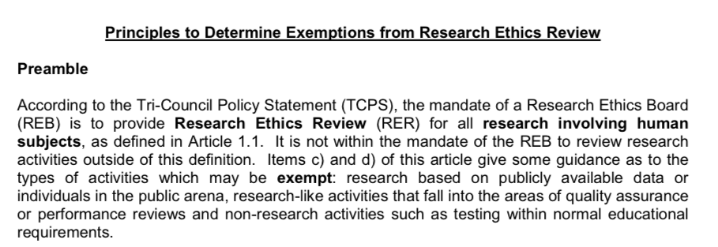
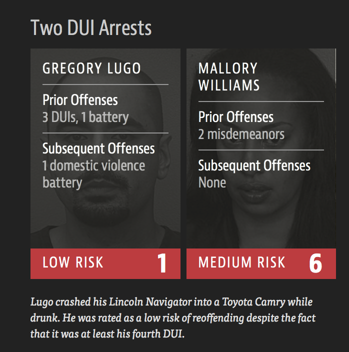

```{r setup, include=FALSE}
knitr::opts_chunk$set(echo = FALSE, warning = F, message = F)
library(tidyverse)
```

## Class Survey


## Today's Class

Identification of ethical considerations involving research where data is collected:

- History of Ethical Codes: Nuremberg Code; and Declaration of Helsinki. 
- Tuskegee Syphilis Study
- Informed consent
- Ethical issues in Data Science Research
- Ethical issues using Public Data 
- Bias and Inclusion in AI Systems


## Research Ethics

- Medical and scientific research involving humans usually require approval and monitoring by an ethics board.
- UofT has several ethics review boards.
- For example, if a survey is given to STA130 students then unless we are given permission, by the UofT ethics board, and students in the course then we would not be able to publish the findings (even the summary statistics) of the survey.   
- Why are institutions such as Universities so cautious?


# History of Ethical Codes

## Nazi Medical Experiments

<div class="columns-2">


Experiments on prisoners included: 

- Injecting dye into the eyes of twins to study conjoined twins.

- Removal of bones, muscles, nerves without anesthesia to study bone, muscle, and nerve regeneration.

- Infection with malaria then treated with various drugs to test efficacy.

</div>
## Government Misuse of Data

- Systematic killing of several million Jews in Europe required extensive planning, organization, and coordination.

- Government statistical agencies conducted special censuses or population registries in certain places.

- The completed forms from these data collections were used to provide names and addresses of Jews to be included in transports to concentration camps and extermination camps. 

(Sletzer, 1998)

## Government Misuse of Data

- In 1939 the census in Germany attempted to identify "racial" Jews according to categories. 
- The religion of all four grandparents were taken into account in addition to the person's religion to identify "racial" Jews.
- The German statistical office was able to produce a report "Jews and Jews or Mixed Ancestory".

(Sletzer, 1998)


## Government Misuse of Data

- The 1930 Dutch census were one of several data sources used to identify high density of Jewish population.
- 1940 U.S. population census collected information on ancestory.
- This data was used in internment of Japanese-Americans at the outbreak of World War II.

(Sletzer, 1998)


## Nuremberg Code

<div class="columns-2">


- Ethical codes often emerge out of crisis events.
- The Nuremberg code was formulated in August 1947, in Nuremberg, Germany, by American judges sitting in judgment of Nazi doctors accused of conducting murderous and torturous human experiments in the concentration camps.
- The judges at Nuremberg realized the importance of Hippocratic code (do no harm) was not sufficient.
</div>

## Nuremberg Code

- More was necessary to protect human research subjects. 
- Judges articulated a sophisticated set of 10 research principles centered on the research subject. 
- These principles, which we know as the __Nuremberg Code__, included a new, comprehensive, and absolute requirement of informed consent (principle 1), and a new right of the subject to withdraw from participation in an experiment (principle 9). 

## Nuremberg Code

The Nuremberg code codified many of our standard principles of ethical research today including: 

- research must appropriately balance risk and potential reward (e.g., clinical equipoise), 
- researchers must be well versed in their discipline and ground human experiments in animal trials.


## Declaration of Helsinki

- A set of ethical principles for medical research involving human subjects, including research on identifiable human material and data.
- The Declaration developed the ten principles first stated in the Nuremberg Code, and tied them to the Declaration of Geneva (1948), a statement of physicians' ethical duties.

## Declaration of Helsinki

The principles include: 

- risks, burdens, benefits; 
- vulnerable groups and individuals; 
- scientific requirements and research protocols; research ethics committees; 
- privacy and confidentiality; informed consent; 
- use of placebo; 
- Research Registration and Publication and Dissemination of Results


## Ethical Scandals lead to U.S. Law

- These codes did not carry the weight of law in the U.S. until after a series of scandals in the 1960s and 1970s.
- This led to the 1974 National Research Act, which established the National Commission for the Protection of Human Subjects of Biomedical and Behavioral Research. 
- A notable result of the commission was establishing institutional __ethics review boards__ (also known as IRB or REB) which act as independent panels that review research proposals to assess possible harms to human subjects.
- This gives research institutions the power and responsibility to self-regulate through these boards.

## Ethical Scandals: Tuskeege Syphillus Study

- The Tuskeege syphilis study was one of the most notable scandals.
- In 1932 US government scientists enrolled 400 African American males from Alabama, known to be infected with syphilis (a sexually transmitted infection that can cause serious health problems).
- Study participants were followed-up to examine long-term effects of syphilis.

##  Ethical Scandals: Tuskeege Syphillus Study

<div class="columns-2">

<a href="https://www.nytimes.com/2016/06/18/upshot/long-term-mistrust-from-tuskegee-experiment-a-study-seems-to-overstate-the-case.html">

</a>

- Study participants told they were being treated for “bad blood” but received no medical intervention.
- The subjects were never told they had syphilis. 
Subjects were denied access to treatment, even for years after penicillin came into use in 1947.
- Study lasted for four decades; exposed in 1972. 

</div>

##  Ethical Scandals: Tuskeege Syphillus Study

<div class="columns-2">

<a href="https://www.cdc.gov/tuskegee/clintonp.htm">

</a>

By 1972, 

 - 28 study participants had died due to syphilis
 - 100 had died from conditions related to syphilis
 - 40 wives were infected
 - 19 infants infected

On May 16 1997, President Clinton apologized for the role of US government in this study.
</div>

## Ethical Scandals: Tuskeege Syphillus Study

- Subjects were not given appropriate information about the risks and benefits of the study.
- After subjects informed about the risks and benefits they did not give their permission to participate in the study.


## Informed Consent

Three elements of informed consent:

1. Information
2. Comprehension
3. Voluntariness

## Informed Consent

__Information:__ the research procedure, their purposes, risks and anticipated benefits, alternative procedures (where therapy is involved), and a statement offering the subject the opportunity to ask questions and to withdraw at any time from the research.

[Belmont Report](https://www.hhs.gov/ohrp/regulations-and-policy/belmont-report/read-the-belmont-report/index.html#xinform)

## Informed Consent

__Comprehension:__ The manner and context in which information is conveyed is as important as the information itself. For example, presenting information in a disorganized and rapid fashion, allowing too little time for consideration or curtailing opportunities for questioning, all may adversely affect a subject's ability to make an informed choice.

[Belmont Report](https://www.hhs.gov/ohrp/regulations-and-policy/belmont-report/read-the-belmont-report/index.html#xinform)

## Informed Consent

__Voluntariness:__ An agreement to participate in research constitutes a valid consent only if voluntarily given. This element of informed consent requires conditions free of coercion and undue influence.

[Belmont Report](https://www.hhs.gov/ohrp/regulations-and-policy/belmont-report/read-the-belmont-report/index.html#xinform)

-------------


# Ethics in Data Science Research

## Ethics in Data Science Research 

- Regulations built around the research/practice distinction in medicine are a method for signaling and negotiating temporary changes to physician-patient relationship.
- A patient must be informed, and consent to, situations in which a physician may no longer be making or be able to make decisions in the best interest of the patient. 
- In a research context, a physician has the best interest of the social collective as an explicit competing interest to the well-being of the patient. 
- There is no easy analogue for the physician-researcher in data science.

(Metcalfe and Crawford, 2016)

## Ethics in Data Science Research 

- What are the ethical obligations data scientists have for the well-being of human subjects in data science research? How do we assess that those obligations are being met?
- Currently there are no laws that address these questions.
- Several organizations (e.g., [Statistical Society of Canada](https://ssc.ca/sites/ssc/files/data/Members/public/Accreditation/ethics_e.pdf), [American Statistical Association](http://www.amstat.org/ASA/Your-Career/Ethical-Guidelines-for-Statistical-Practice.aspx), [Association for Computing Machinery](https://www.acm.org/about-acm/acm-code-of-ethics-and-professional-conduct)) have developed detailed statements on topics such as professionalism, integrity of data and methods, responsibilities to stakeholders, conflicts of interest, and the response to allegations of misconduct. 


##  Ethics in Data Science Research

- One challenge in developing an analogue of medical research ethics in the data science framework is that the criteria for human-subjects' protections. 
- The criteria depends on an unstated assumption that the risk to research subjects depends on what kind of data is obtained and how it is obtained, not what is done with the data after it is obtained.
- This assumption is based on the idea that data which is public poses no new risks for human subjects.
- Data science drives significant changes to "how we know" by creating new knowledge through tying together previously disconnected data sets.


(Metcalfe and Crawford, 2016)


##  Ethics in Data Science Research

<div class="columns-2">

<a href="http://www.research.utoronto.ca/wp-content/uploads/documents/2013/05/Principles-to-Determine-Exemptions-from-Research-Ethics-Review-April-2006.pdf">

</a>

- Most ethics boards exempt research of existing data, documents, records, and specimens if that data is publicly available.
- This means that most non-medical data science will receive very little review.

(Metcalfe and Crawford, 2016)

</div>
## New York City Taxi & Limousine Commission

- In 2013, the New York City Taxi & Limousine Commission released a data set of 173 million individual cab rides. 
- The data set included the pickup and drop off times, locations, fare and tip amounts. 
- The taxi drivers’ medallion numbers were anonymized 

(Metcalfe and Crawford, 2016)

## New York City Taxi & Limousine Commission

- Researchers were able to de-anonymized the data to reveal sensitive information such as any driver’s annual income and enabling researchers to infer their home address (Franceschi-Bicchierai, 2015). 
- A data scientist at Neustar Research showed that by combining this data set with other forms of public information like celebrity blogs you could track well-known actors, and predict likely home addresses of people who frequented strip clubs (Tockar, 2014). 
- Another researcher demonstrated how the taxi data set could be used to predict which drivers were devout Muslims by observing which drivers stopped at prayer times (Franceschi-Bicchierai, 2015).

(Metcalfe and Crawford, 2016)

## Cambridge Analytica

<div class="columns-2">
- Recent news reports claim that Cambridge Analytica bought 50 million Facebook profiles from a researcher.

- Only 270,000 users consented to having their data used by the researcher.

- Cambridge Analytica combined The Facebook data with other databases to build profiles of these users. 


<a href="https://www.nytimes.com/2018/03/23/technology/zuckerberg-facebook-employees.html">

</a>

- This allowed the company to use the data to target users with specific ads. 

- What ethical obligations should a private company have in protecting users' 
data?
</div>

## Ethics of Public Data

- Users of data services, such as social media platforms, often know very little about how their private data will be used in research.
- Should Facebook users now expect that their social media activities could affect their ability to get a loan or influence how they vote? 
- Is it reasonable to assume that social behavior on Facebook is the same as social relationships outside of Facebook? Could this assumption cause economic harm to individuals and communities? 

(Metcalfe and Crawford, 2016)

## Ethics of Public Data

- If human subjects research regulations assume that public data sets are harmless, it will be nearly impossible to review the consequences of the people affected.
- These "data subjects" may have no knowledge that they are are part of a study that might affect their future opportunities or well-being.

(Metcalfe and Crawford, 2016)

## Experimentation on Data Subjects

- An A/B test randomizes subjects to two conditions A and B.
- Randomized experiments can be used to establish causation not just correlation.
- Facebook randomized 700,000 users to two different types of newsfeeds to investigate if it could manipulate their emotions.
- Since Facebook is a private company it was not required to use any independent review process to approve the research.

## Predicting Recidivisim

- Consider a simple Artificial Intelligence system designed to predict recidivism based on a person's facial features.
- A data set of 1,001 adult males convicted of crimes were assessed for personality traits associated with their facial features.
- Each person in the data set was given a recidivism score (extremely unlikely to reoffend 0 - 100 extremely likely to reoffend), and physiognomy score (facial features atypical of criminal 0 - 100 facial features typical of a criminal)


```{r, fig.height=2, cache=TRUE}
set.seed(13)
library(tidyverse)
recid_score <- rnorm(1000, 50, 5)
physiog_score <- recid_score + rnorm(n = 1000, 30, 2)

dat0 <- data_frame(physiog_score, recid_score) %>% 
  mutate(test = ifelse(physiog_score > 85 & recid_score > 55 , "Yes", "No")) 

dat1 <-  dat0 %>%
  filter(test == "Yes") %>%
  mutate(recid_score = recid_score - 15)

dat <- rbind(dat0,dat1)

dat_crime <- dat %>% 
  mutate(testdat = ifelse(recid_score < 50 & physiog_score > 85, "Yes", "No"), id = row_number()) %>%
  filter(testdat == "No")
dat_new <- dat %>% 
  mutate(testdat = ifelse(recid_score < 50 & physiog_score > 85, "Yes", "No")) %>%
  filter(testdat == "Yes")

 dat_crime %>%
  ggplot(aes(x = physiog_score, y = recid_score)) + 
  geom_point(aes(colour = testdat)) 
```


## Predicting Recidivisim

- Linear regression was used to build a prediction model.

```{r, echo=TRUE, cache=TRUE}
set.seed(10)
train <- dat_crime %>% sample_frac(size = 0.8)
test <- dat_crime %>% anti_join(train, by = 'id')
reg_mod <- lm(recid_score ~ physiog_score, data = train)
summary(reg_mod)$r.squared
yhat <- predict(reg_mod, newdata = test)
y <- test$recid_score
sqrt(sum((y-yhat)^2)/length(test$recid_score))
```

--------

```{r}
dat_crime %>%
  ggplot(aes(x = physiog_score, y = recid_score)) + 
  geom_point(aes(colour = "red")) + geom_smooth(method = "lm", se = F) 
```


## Predicting Recidivisim

- The company now claims that the model will work in predicting recidivism in another country.
- The software is used a few cases at a time.
- After 140 cases the police force that is using the software decide to evaluate the accuracy of the predictions.

```{r, echo=TRUE}
yhat <- predict(reg_mod, newdata = dat_new)
y <- dat_new$recid_score
sqrt(sum((y - yhat)^2) / length(dat_new$recid_score))
```


## Predicting Recidivisim


```{r}
train %>%
  ggplot(aes(x = physiog_score, y = recid_score)) + 
  geom_point(aes(colour = testdat)) +
  geom_smooth(method = "lm", se = F) +
  geom_point(data = dat_new, aes(colour = "blue")) +
  scale_color_manual(labels = c("New Data", "Training"), values = c("blue", "red")) +
  guides(color=guide_legend("Data")) + theme_minimal()
```


## Predicting Future Crime - Pro Publica Investigation of COMPAS

<div class="columns-2">

<a href="https://www.propublica.org/article/machine-bias-risk-assessments-in-criminal-sentencing">

</a>




</div>

## Predicting Future Crime - Pro Publica Investigation of COMPAS

- [Pro Publica investigated](https://www.propublica.org/article/machine-bias-risk-assessments-in-criminal-sentencing) an AI system used by courts and judges to predict recidivism.
- Pro Publica obtained the risk scores assigned to more than 7,000 people arrested in Broward County, Florida, in 2013 and 2014. 
- They checked to see how many were charged with new crimes over the next two years, the same benchmark used by the creators of the algorithm.
- 20% of the people predicted to commit violent crimes actually went on to do so.


## Bias and Inclusion in AI Systems and ML Algorithms

- AI systems are taught what they “know” from training data.   
- Training data can be incomplete, biased, or skewed.  This is sometimes referred to as "algorithmic bias".
- Training data may come from poorly defined non-representative samples of a population.
- These problems with training data may not be obvious if the data set construction is non-transparent.

## Ethical Concerns in AI and ML Algorithms

- Should AI systems be  used in sensitive or high-stakes contexts?   
- Who gets to make these decisions? 
- What is the proper degree of human involvement in various types of decision-making?

