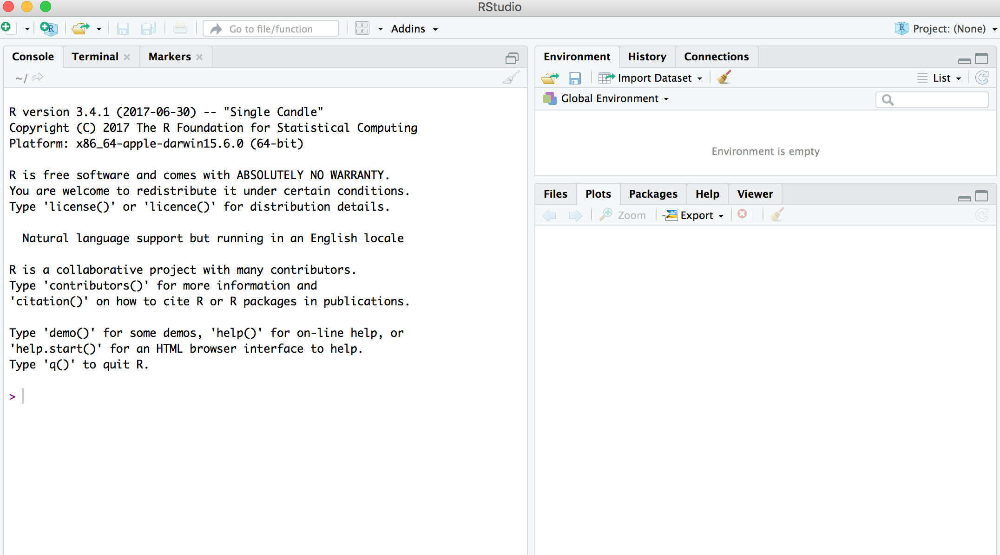
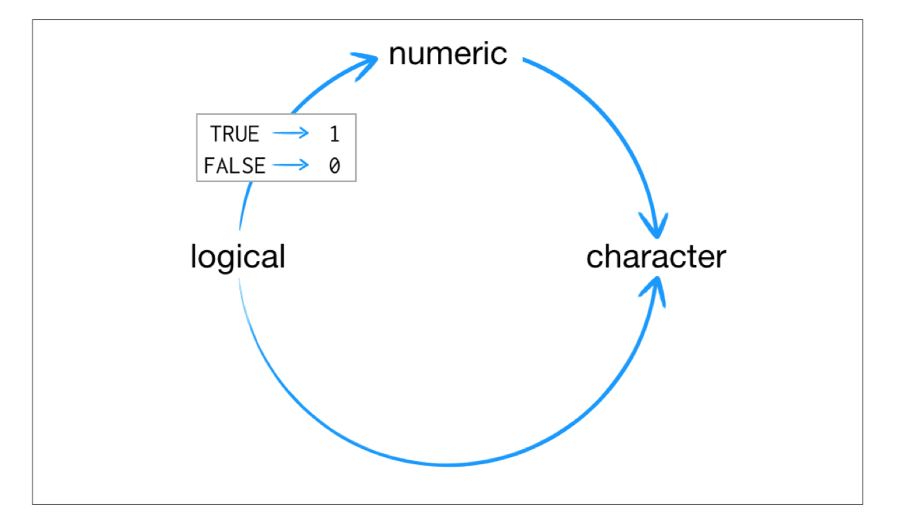
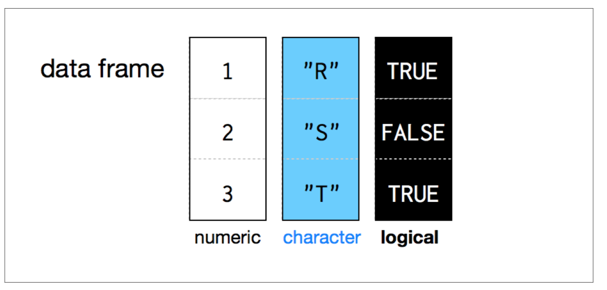
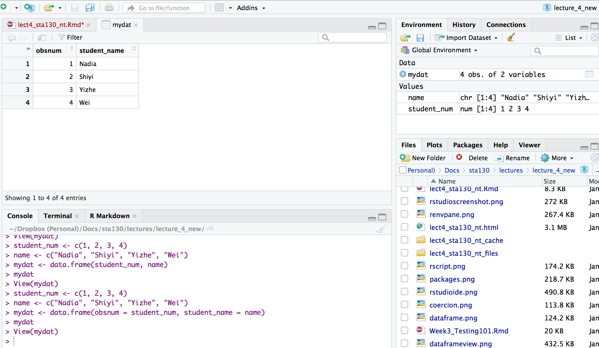
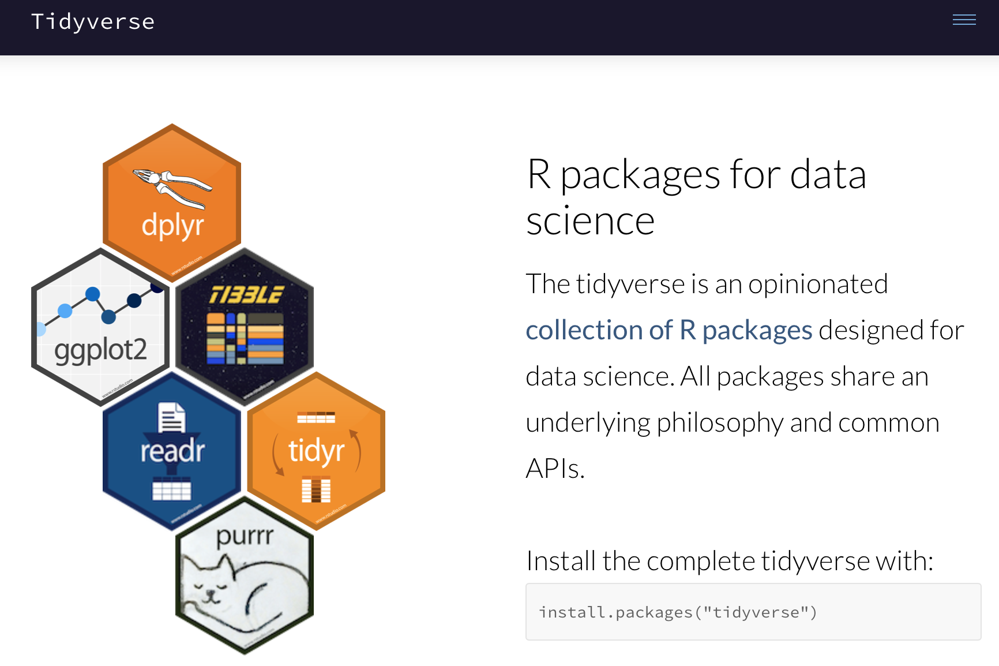
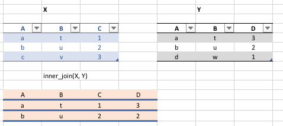

```{r setup, include=FALSE}
knitr::opts_chunk$set(echo = TRUE, warning = FALSE, message = FALSE)
library(tidyverse)
```


## Today's Class

- RStudio user interface
- R Objects
- R Functions
- R Scripts
- R Packages
- R Lists
- R Notation
- R Missing Data
- dplyr

## Announcements

- Tutorial grades will be assigned according to the following marking scheme.

|                                    | Mark |
|------------------------------------|------|
| Attendance for the entire tutorial | 1    |
| Assigned homework completion^a^    | 1    |
| In-class exercises                 | 4    |
| Total                              | 6    |


- You will learn about the mentorship program in this week's tutorial (3% of final grade).

## RStudio User Interface





## R Objects

- R lets you save data by storing it inside an R object. 
- What’s an object? Just a name that you can use to call up stored data. 

```{r}
x <- 1
x
```


## Environment Pane in RStudio

- When you create an object, the object will appear in the environment pane of RStudio.


## Functions

- R comes with many functions that you can use to do sophisticated tasks like random sampling. 
- For example, you can round a number with the round function `round()`, or calculate its absolute value with `abs()`. 

-  Write the name of the function and then the data you want the function to operate on in parentheses:

```{r}
round(-2.718282, 2)
abs(-5)
abs(round(-2.718282, 2))
```


## Function Constructor

> -  Every function in R has three basic parts: a name, a body of code, and a set of arguments. 

> - To make your own function, you need to replicate these parts and store them in an R object, which you can do with the function function. 

> - To do this, call `function()` and follow it with a pair of braces, `{}`: `my_function <- function() {}`


## Function Constructor

- We can simulate rolling a pair of dice and adding the result with the code:

```{r}
die <- 1:6
dice <- sample(die, size = 2, replace = TRUE) 
sum(dice)
```

## Function Constructor

- We can create our own function with 

```{r, cache=TRUE}
roll <- function() {
  die <- 1:6
  dice <- sample(die, size = 2, replace = TRUE) 
  sum(dice)
}
```

Call the function `roll()`

```{r}
roll() # call the function.  NB: result will differ with every call
```


## Function Arguments

Instead of rolling one die consider rolling four or ten dice then adding the results of all the rolls together. 

```{r,cache=TRUE}
roll2 <- function(numrolls) { # x is the argument of the function roll2
  die <- 1:6
  dice <- sample(die, size = numrolls, replace = TRUE) # the size of the sample 
  sum(dice) # add up the roll results
}
```

`numrolls` is called an _argument_ of the function `roll2()`.

Let's simulate rolling ten dice and adding the results together.

```{r}
roll2(10)
```


## Scripts

- If we want to edit the function `roll2()` then we will want to save it in a script.

- To do this in RStudio File > New File > R script in the menu bar.


## Packages

- You’re not the only person writing your own functions with R. 
- Many professors, programmers, and statisticians use R to design tools that can help people analyze data. 
- They then make these tools free for anyone to use. 
- To use these tools, you just have to download them. They come as preassembled collections of functions and objects called packages. 
- We have already used two packages `ggplot2` and `dplyr`.

## Packages

To install the package `tidyverse` in RStudio go to the Packages tab in RStudio and click Install.


To load a package type 
```{r,eval=FALSE}
library(tidyverse)
```


## RStudio IDE

- IDE: Integrated Development Environment.
- The RStudio IDE has many features that we will not use in the course.


- The __console__ is where you can type an R command at the prompt and the result is returned.
- Write code in an R script, R Markdown document, or R Notebook.  
- Run a script or R chunks from an R Markdown or R Notebook by pushing the run button in the chunk.

## R Objects 

- R stores data in objects such as vectors, arrays, and matricies.
- In most applications we will ususally load data from an external file.  

## R Objects - Atomic Vectors

You can make an atomic vector by grouping some values of data together with c:

```{r}
die<-c(1,2,3,4,5,6) 
die
is.vector(die)
length(die)
```

You can also make an atomic vector with just one value. R saves single values as an atomic vector of length 1:

```{r}
two <- 2 
two
```

## R Objects - Atomic Vectors: Integer and Character

- Each atomic vector can only store one type of data. You can save different types of data in R by using different types of atomic vectors. 

- R recognizes six basic types of atomic vectors: doubles, integers, characters, logicals, complex, and raw.

- We will not be using complex or raw types in STA130.

- Integer vectors included a capital L with input, and character vectors have input surounded by quotation marks.


## R Objects - Atomic Vectors: Integer and Character

```{r, error=TRUE}
mynums <- c(2L,3L)
courses <- "STA130"
courses <- c("STA130", "MAT137")
sum(mynums)
sum(courses)
sum(courses == "STA130")
```

## R Objects - Double Vectors

- A double vector stores real numbers.  Doubles are often called numerics.

```{r}
die <- c(1,2,3,4,5,6)
typeof(die)
```

## R Objects - Logical Vectors

- Logical vectors store TRUEs and FALSEs, R’s form of Boolean data. Logicals are very helpful for doing things like comparisons:

```{r}
3 > 4
```

- TRUE or FALSE in capital letters (without quotation marks) will be treated as logical data. R also assumes that T and F are shorthand for TRUE and FALSE.

```{r}
logic <- c(TRUE, FALSE, TRUE) 
logic
```

## R Objects - Atomic Vectors: `dim()`

You can transform an atomic vector into an n-dimensional array by giving it a dimen‐ sions attribute with dim. 

```{r}
die <- c(1,2,3,4,5,6)
dim(die) <- c(2,3) # a 2x3 matrix
die 
```

```{r}
die <- c(1,2,3,4,5,6)
dim(die) <- c(3,2) # a 2x3 matrix
die 
```

R always fills up each matrix by columns, instead of by rows unless you use `matrix()` or `array()`.

## Factors

- Factors are R’s way of storing categorical information, like ethnicity or eye color. 
- A factor as something like sex since it can only have certain values.  
- Factors very useful for recording the treatment levels of a categorical variable.

```{r}
sex <- factor(c("male", "female", "female", "male"))
typeof(sex)
unclass(sex) # shows how R is storing the factor vector 
```

## Coercion

R always follows the same rules when it coerces data types. Once you are familiar with these rules, you can use R’s coercion behavior to do surprisingly useful things.



For example `sum(c(TRUE, TRUE, FALSE, FALSE))` will become `sum(c(1, 1, 0, 0))`.

```{r}
sum(c(TRUE, TRUE, FALSE, FALSE))
```

## Lists

- Lists are like atomic vectors because they group data into a one-dimensional set. 
- Lists do not group together individual values. 
- Lists group together R objects, such as atomic vectors and other lists.
- For example, you can make a list that contains a numeric vector of length 31 in its first element, a character vector of length 1 in its second element, and a new list of length 2 in its third element. 

```{r}
list1 <- list(1:31, "Prof. Taback", list(TRUE, FALSE))
list1
```


## Data Frames

- Data frames are the two-dimensional version of a list. 
- They are the most useful storage structure for data analysis
- A data frame is R’s equivalent to the Excel spreadsheet because it stores data in a similar format.

## Data Frames

- Data frames group vectors together into a two-dimensional table. 
- Each vector becomes a column in the table. 
- As a result, each column of a data frame can contain a different type of data; but within a column, every cell must be the same type of data.



## Data Frames

```{r,cache=TRUE}
student_num <- c(1, 2, 3, 4)
name <- c("Nadia", "Shiyi", "Yizhe", "Wei")
mydat <- data.frame(obsnum = student_num, student_name = name)
mydat
```


- Creating a data frame by hand takes a lot of typing, but you can do it with the `data.frame()` function. 
- Give `data.frame()` any number of vectors, each separated with a comma. 
- Each vector should be set equal to a name that describes the vector. 
- `data.frame()` will turn each vector into a column of the new data frame.

## Data Frames

You can view a data frame in RStudio by clicking on the data frame name in the Environment tab



## R Notation - [ , ]

- To extract a value or set of values from a data frame, write the data frame’s name followed by a pair of square brackets with a comma [ , ].

```{r, eval=FALSE}
mydat[ , ]
```

## R Notation - [ , ]

```{r}
mydat
mydat[1,2] # the value in row 1 and column 2
mydat[c(1,2),2] # all values in rows 1 and 2 in second column
```


## R Notation - $

The `$` tells R to return all of the values in a column as a vector. 

```{r}
mydat$student_name
vec <- mydat$student_name # assign it to vec
attributes(vec) # info associated with object vec
vec[2] # get second element of vector
```

## R Notation - combine [,] and $

```{r}
mydat[mydat$obsnum == 1,] # first row of data frame and all columns
mydat[mydat$obsnum == 1 | mydat$obsnum == 4 ,] # first and fourth rows of data frame and all columns
```


## Missing Data - `NA`

- Missing information problems happen frequently in data science. 
- For example a value is mising because the measurement was lost, corrupted, or never recorded. 
- The `NA` character is a special symbol in R. It stands for “not available” and can be used as a placeholder for missing information.

```{r, error=TRUE}
1 + NA
```

## Missing Data - `na.rm()`

- Suppose you collected the ages of five students, but you forgot to record the fifth students age.

```{r, error=TRUE}
age <- c(19, 20, 17, 20, NA)
mean(age) # mean will be NA
```

```{r}
age <- c(19, 20, 17, 20, NA)
mean(age, na.rm = TRUE) # R will ignore missing values
```

## Identify and Set Missing Data - `is.na()`

```{r}
age <- c(19, 20, 17, 20, NA)
is.na(age) # check which elements of age are missing
age[1] <- NA # set the first element of age to NA
age
```


## Summary of R Data Structures


## Tidyverse



[https://www.tidyverse.org](https://www.tidyverse.org)

```{r,eval=TRUE, cache=TRUE, eval=TRUE, echo=FALSE}
# Uncomment next line if the rvest package is not installed
# install.packages("rvest") 
library(rvest)
library(tidyverse)

url <- "https://www.canada.ca/en/public-health/services/surveillance/respiratory-virus-detections-canada/2017-2018/respiratory-virus-detections-isolations-week-1-ending-january-6-2018.html"
 
# download and read table into flu_dat 
flu_dat <- url %>% 
  read_html() %>% 
  html_nodes(xpath = '/html/body/main/div[1]/div[2]/details[1]/table') %>% 
  html_table()

# clean up the file
fludat <- flu_dat[[1]]
dat <- as.data.frame(sapply(select(fludat,2:23), as.numeric))
fludat <- cbind(`Reporting Laboratory` = fludat[,1],dat)

fludat_prov <- fludat %>% 
  filter(row_number() < 42 & row_number() %in% c(1, 2, 3, 4, 12, 29, 30, 33, 34, 36, 37,38, 39)) %>%
  select(prov = `Reporting Laboratory`, testpop_size = `Flu Tested`, fluA = `Total Flu A Positive`) 

write_csv(fludat_prov,"fludat_prov.csv")

fludat_prov$prov <- recode(fludat_prov$prov, "Province of Québec" = "Quebec", "Province of Ontario" = "Ontario", "Province of Saskatchewan" = "Saskatchewan", "Province of Alberta" = "Alberta")


popurl <- "https://en.wikipedia.org/wiki/List_of_Canadian_provinces_and_territories_by_population_growth_rate"

popdat <- popurl %>% 
  read_html() %>%
  html_nodes(xpath = '//*[@id="mw-content-text"]/div/table')  %>%
  html_table()

popdat <- popdat[[1]]

popdat <- popdat %>% 
  select(prov = `Province/Territory`, prov_pop_size = `2016 Census`) %>%
  filter(row_number() < 14)

# remove comma and coerce to numeric
popdat$prov_pop_size <- as.numeric(gsub(",([[:digit:]])", "\\1", popdat$prov_pop_size)) 

popdat$prov[popdat$prov=="Newfoundland and Labrador"] <- "Newfoundland"

popdat$region <- c("Territories",NA,"West","Territories","West","West","East", NA,"Atlantic","Atlantic","Territories","Atlantic","Atlantic")

write_csv(popdat,"popdat.csv")

```

## Canadian Flu Rates with `dplyr`

The provincial rates for the week ending January 6, 2018 are in the file fludat_prov.csv and the the size of the population in each province is in the file popdat.csv.  The code below reads the files into R data frames.

```{r, cache=TRUE}
library(tidyverse)
fludat_prov <- read_csv("fludat_prov.csv") # import data from file
popdat <- read_csv("popdat.csv") # import data from file
```


## Canadian Flu Rates with `dplyr`

```{r}
head(fludat_prov) # head shows the first six rows of a data frame
head(popdat)
```


## Canadian Flu Rates with `dplyr` 

How many Provinces/Territories are in the fludat_prov data frame?

```{r}
fludat_prov %>% summarise(numprov = n()) # n() counts the number of rows in the data frame
```

## Canadian Flu Rates with `dplyr` 

Do any variables in fludat or popdat have missing values?

```{r}
fludat_prov %>% filter(is.na(prov) == TRUE | is.na(testpop_size) == TRUE | is.na(fluA) == TRUE) 
popdat %>% filter(is.na(prov) == TRUE | is.na(prov_pop_size) == TRUE | is.na(region) == TRUE) 
```


## Canadian Flu Rates with `dplyr` 

Recode specific values using R data frame notation [,] and $.

```{r}
popdat$region[popdat$prov == "Alberta"] <- "West" #recode only the region value for Alberta
popdat$region[popdat$prov == "Quebec"] <- "East" #recode only the region value for Alberta
popdat$region #print region variable in popdat data
```


## Canadian Flu Rates with `dplyr` - Joining Two Tables with `inner_join()`

We can join two data frames with `inner_join(x,y)`: return all rows from x where there are matching values in y, and all columns from x and y. If there are multiple matches between x and y, all combination of the matches are returned.

```{r}
fludat_prov %>% inner_join(popdat, by = "prov")
```

Why are there only 9 observations when there are 13 Provinces/Territories?


## Canadian Flu Rates with `dplyr` - Joining Two Tables with `inner_join()`

```{r}
fludat_prov$prov
popdat$prov
```

Province needs to be recoded.  Exercise on this week's practice problems.


## Canadian Flu Rates with `dplyr` - Joining Two Tables with `inner_join()`




